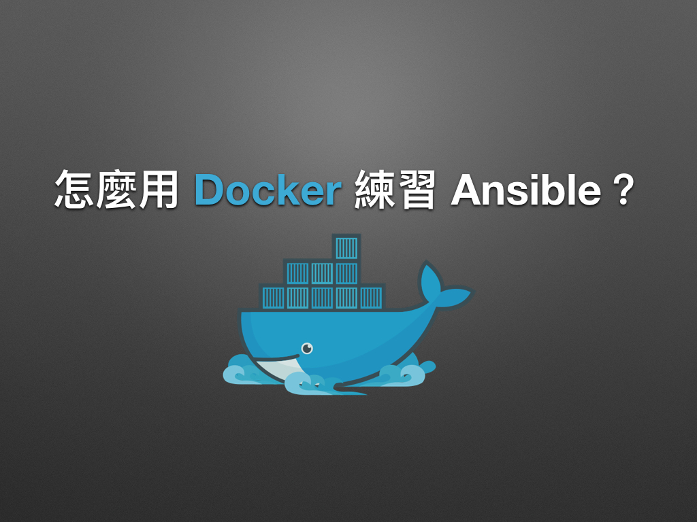
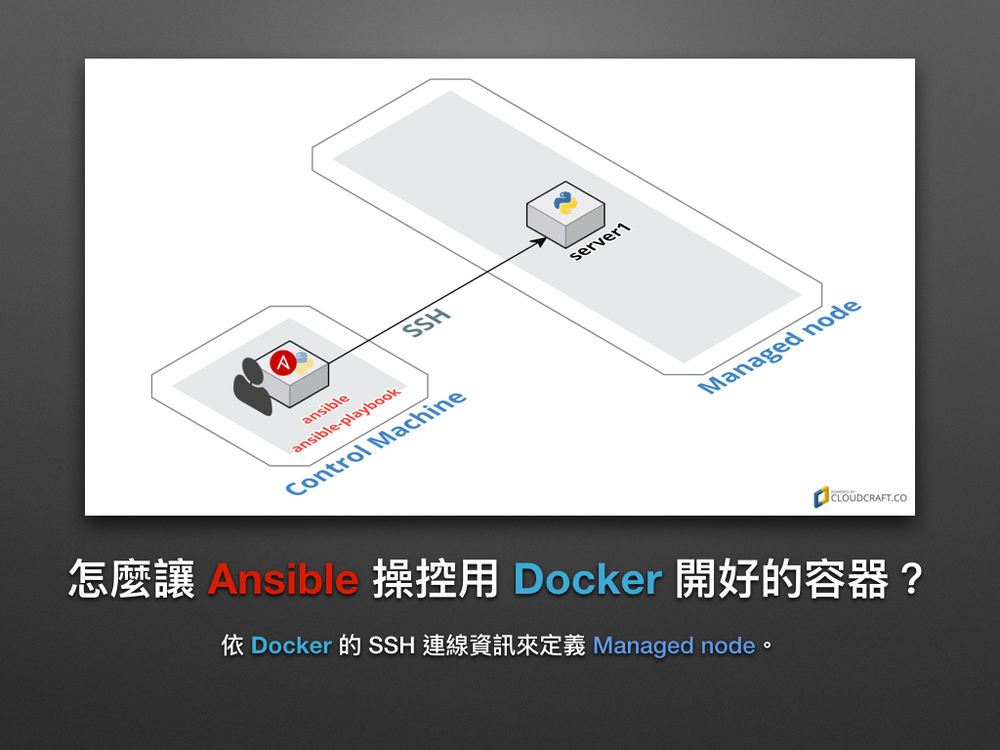

# 現代 IT 人一定要知道的 Ansible 自動化組態技巧

## 05. 怎麼用 Docker 練習 Ansible？

在前一章「[04. 怎麼用 Vagrant 練習 Ansible？](04.how-to-practive-ansible-with-vagrant.md)」我們是使用 Virtualbox + Vagrant 的組合在進行 Ansible 的練習，而這次凍仁將會使用當前最火紅的 [Docker][docker_official] 虛擬化容器技術來建置虛擬環境。

[docker_official]: https://www.docker.com

Docker 的好凍仁就不多說了，若客倌對 Docker 還不是很了解的話，您可以看看在下先前分享過的簡報。

- [前端工程師一定要知道的 Docker 虛擬化容器技巧 | 凍仁的筆記][virtualization-with-docker-container]

[virtualization-with-docker-container]: http://note.drx.tw/2016/07/virtualization-with-docker-container-basic-for-f2e.html

### 怎麼安裝 Docker？

請安裝最新版的 [Docker][download_docker] 即可。這裡凍仁將不會特別介紹怎麼安裝 Docker，這部份題還請參考以下文章。

- [於 Ubuntu 14.04 安裝 Docker 1.9.1+ | 凍仁的筆記][install-docker-191-on-ubuntu-1404]
- [在 OSX 10.11.4 安裝 Docker for Mac (v1.11.0-beta8) | 凍仁的筆記][setup-native-docker-for-mac]

[download_docker]: https://www.docker.com/products/docker#/
[install-docker-191-on-ubuntu-1404]: http://note.drx.tw/2016/01/install-docker-191-on-ubuntu-1404.html
[setup-native-docker-for-mac]: http://note.drx.tw/2016/05/setup-native-docker-for-mac-v1.11-and-migrate-docker-toolbox-on-osx-10.11.4.html

### 怎麼用 Docker 管理容器 (Container)？

這裡凍仁只簡單地列出本次主題所會用到的指令。

1. 取得凍仁事先建立好的 Docker image。

        $ docker pull chusiang/ansible-managed-node:ubuntu-14.04

        #### 使用者帳戶 #####################
        #
        # |           | username | password |
        # |-----------|----------|----------|
        # | root user | root     | root     |
        # | sudo user | docker   | docker   |

2. 建立並執行容器。

        $ docker run --name server1 -d -P chusiang/ansible-managed-node:ubuntu-14.04
        ecdf39055ba2a932fa8c76a75afdec1cd8f516285bee6f4e07c16c67f4009211

3. 關閉容器。

        $ docker stop server1

4. 啟用容器。

        $ docker start server1
        
5. 觀看容器狀態和查詢 SSH 綁定的埠口 Port。

        $ docker ps
        CONTAINER ID        IMAGE                                        COMMAND                  CREATED             STATUS              PORTS              NAMES
        ecdf39055ba2        chusiang/ansible-managed-node:ubuntu-14.04   "/usr/sbin/sshd -D"      20 hours ago        Up 17 seconds       0.0.0.0:32805->22/tcp    server1

6. 移除容器。

        $ docker rm server1

        # -f, --force: 強制移除，包含正在執行的容器。

### 怎麼讓 Ansible 操控用 Docker 開好的容器？

接下來，我們將會用 Ansible 來控制 Docker 在本機上建立的容器，其作業系統版本為 Ubuntu 14.04 64-bit (AMD64)，大家可以從 [Dockerfile][ubuntu_14.04_image] [^1] 了解這個 image 包了什麼。

[ubuntu_14.04_image]: https://github.com/chusiang/ansible-managed-node.dockerfile/blob/master/ubuntu-14.04/Dockerfile

1. 取得容器的 OpenSSH 設定：請特別留意 `0.0.0.0:32805->22/tcp` 的值。

        $ docker ps
        CONTAINER ID        IMAGE                                        COMMAND                  CREATED             STATUS              PORTS              NAMES
        ecdf39055ba2        chusiang/ansible-managed-node:ubuntu-14.04   "/usr/sbin/sshd -D"      20 hours ago        Up 17 seconds       0.0.0.0:32805->22/tcp    server1

2. 設定 **ansible.cfg**：將 `remote_user` 設為 `docker`。

        $ vi ansible.cfg
        [defaults]
        
        hostfile = hosts
        remote_user = docker
        host_key_checking = False

3. 設定 **hosts**。

        $ vi hosts
        server1  ansible_ssh_host=127.0.0.1  ansible_ssh_port=32805 ansible_ssh_pass=docker
        
        [local]
        server1

 1. `ansible_ssh_host`：請設為本機的 IP。
 2. `ansible_ssh_port`：請設為 `docker ps` 時取得的 SSH port。
 3. `ansible_ssh_pass`：因沒有連線用的 SSH 金鑰，故直接使用密碼的方式進行連線，**建議只於練習環境使用**該參數。

### Hello World on Docker

當已上的設置都完成了，我們就可以在終端機裡用 Docker 建立好的容器來練習 Ansible 了！

    $ ansible all -m command -a 'echo Hello World on Docker.'
    server1 | SUCCESS | rc=0 >>
    Hello World on Docker.

### 後語
   
....

就實戰面來說，凍仁會先在 Vagrant 的虛擬環境先開發好 Ansible Playbooks，之後再看有沒有需求將它給 Dockerize ...。

### 相關連結

- [前端工程師一定要知道的 Docker 虛擬化容器技巧 | 凍仁的筆記][virtualization-with-docker-container]

[^1]: `chusiang/ansible-managed-node:ubuntu-14.04` image  的 Dockerfile 可以在凍仁的 GitHub 找到，其網址為 https://github.com/chusiang/ansible-managed-node.dockerfile/blob/master/ubuntu-14.04/Dockerfile 。
