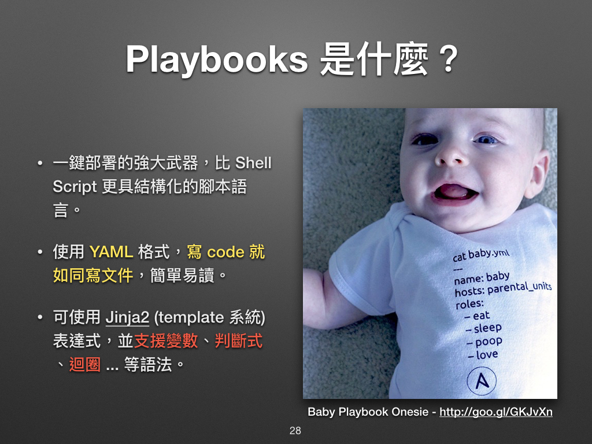

# 現代 IT 人一定要知道的 Ansible 自動化組態技巧

## 06. 怎麼操作 Ansible？

相信大家手邊都有可以練習 Ansible 的環境了，這次凍仁就來談談怎麼操作 Ansible！


一般來說，我們可以用 Ad-Hoc command 和 Playbook 兩種方式來操作 Ansible。


前者是透過一次次簡短的指令來操作 Ansible，而後者則是先把任務寫好，然後再一次執行。兩者的關係就好比我們在 Linux Shell 裡打指令和先寫個 Shell Script 再執行一樣。


### Ad-Hoc Commands 是什麼？

**Ad hoc** 這個單字是來自拉丁文常用短語中的一個短語，通常用來形容為一個特定的問題或任務而專門設定的解決方案 [^1]。**Ad-Hoc Commands** 可以翻譯為**簡短地指令**，在這裡凍仁會用**指令操作模式**來形容它，以常見的 `ping` 和 `echo` 操作為例。

- ping.

  ```
  $ ansible all -m ping
  server1 | SUCCESS => {
      "changed": false,
      "ping": "pong"
  }
  ```

- echo.

  ```
  $ ansible all -m command -a "echo Hello World"
  server1 | SUCCESS | rc=0 >>
  Hello World
  ```

從以上的例子中可以看到 Ad-Hoc commands 一次只能處理一件事情，這即是它與 Playbooks 最大的差異。

> 詳情請參考官方的 [Introduction To Ad\-Hoc Commands | Ansible Documentation][intro_adhoc] 文件。

[intro_adhoc]: http://docs.ansible.com/ansible/intro_adhoc.html


### Playbooks 是什麼？

**Playbook** 就字面上的意思為**劇本**。我們可以透過事先寫好的**劇本 (Playbooks)** 來讓各個 Managed Node 進行指定的**動作 (Plays)** 和**任務 (Tasks)**。 [^2]

簡而言之，Playbooks 是 Ansible 的腳本 (Script)，而且還是個比傳統 Shell Script 還強大數百倍的腳本！如果今天只能記住一件事，請記住 Ansible 最好用、最厲害的就是它的 Playbook！


圖片來源：http://goo.gl/GKJvXn

在一份 Playbook 中，可以有多個 Play、多個 Task 和多個 Module。

- **Play**：通常為某個特定的目的，例如：
 - `Setup a official website with Drupal Drupal` (藉由 Drupal 建置官網)
 - `Restart the API service` (重開 API 服務)
- **Task**：是要實行 Play 這個目地所需做的每個步驟，例如：
 - `Install the Nginx` (安裝 Nginx)
 - `Kill the djnago process` (停用 django 的行程)
- **Module**：Ansible 所提供的各種操作方法，例如：
 - `apt: name=vim state=present` (使用 apt 套件安裝 vim)
 - `command: /sbin/shutdown -r now` (使用 shutdown 的指令重新開機)


> 詳情請參考官方的 [Playbooks | Ansible Documentation][playbooks] 文件。

[playbooks]: http://docs.ansible.com/ansible/playbooks.html


#### `Hello World` Playbook

- 來寫一下我們的第一個 playbook！請建立一個 `hello_world.yml` 的檔案，並將 `---` 開始的內容都寫進去。

  ```
  $ vi hello_world.yml
  ---

  - name: say 'hello world'
    hosts: all
    tasks:

      - name: echo 'hello world'
        command: echo 'hello world'
        register: result

      - name: print stdout
        debug:
          msg: "{{ result.stdout }}"
  ```

- 執行 playbook：在這個範例中，我們執行了 1 個 Play、3 個 Task 和 2 個 Module。

  ```    
  $ ansible-playbook hello_world.yml

  PLAY [say 'hello world'] *******************************************************

  TASK [setup] *******************************************************************
  ok: [server1]

  TASK [echo 'hello world'] ******************************************************
  changed: [server1]

  TASK [print stdout] ************************************************************
  ok: [server1] => {
      "msg": "hello world"
  }

  PLAY RECAP *********************************************************************
  server1                    : ok=3    changed=1    unreachable=0    failed=0
  ```


### 沒有 Ansible 時，我們是怎麼操作的？

凍仁在此附上 Linux Shell [^3] 上的傳統作法，來比對兩者的操作。

#### Shell (command line, cli, console)

- ping.

  ```
  $ ping -c 1 8.8.8.8
  PING 8.8.8.8 (8.8.8.8): 56 data bytes
  64 bytes from 8.8.8.8: icmp_seq=0 ttl=44 time=10.022 ms

  --- 8.8.8.8 ping statistics ---
  1 packets transmitted, 1 packets received, 0.0% packet loss
  round-trip min/avg/max/stddev = 10.022/10.022/10.022/0.000 ms
  ```

- echo.

  ```
  $ echo Hello World
  Hello World
  ```

#### Shell Script

- 建立 `hello_world.sh` 檔案。

  ```
  #!/bin/bash
  echo 'Hello World'
  ```

- 執行。

  ```
  $ bash hello_world.sh
  Hello World
  ```

### 後語

大家或許會問，會寫 script 就夠用了，為什麼還要會寫 playbook 呢？凍仁在此列了幾個理由給大家參考：

1. 若有現成的 script，我們可以用 `shell` module 來執行它，這部份雖不衝突，但使用 `shell` module 會造成每次跑 playbook 都會重複執行，不像其它 module 執行過就不會再執行了。
2. 用 Ansible 的 module 可以把很多雜亂的指令給標準化，例如不同的 Linux 發行版本在安裝套件時需代各種不同的參數。
3. 在現有的 cloud native 的架構下，傳統的 Shell Script 已不符使用，一般而言 Shell Script 只能對一台機器 (instance) 進行操作。

相信大家都知道要怎麼操作 Ansible 了，好好享受 Ansible 帶給我們的樂趣吧！


### 資料來源

- [現代 IT 人一定要知道的 Ansible 自動化組態技巧 | 凍仁的筆記](http://note.drx.tw/2016/05/automate-with-ansible-basic.html)
- [電腦界的隱喻：組態管理 | 軟體架構・絮語][metaphor-in-cm]
- [Ansible Architecture | Ansible Documentation][ansible_architecture]

[metaphor-in-cm]: http://school.soft-arch.net/blog/90699/metaphor-in-cm
[ansible_architecture]: https://docs.ansible.com/ansible/dev_guide/overview_architecture.html


[^1]: 詳情請參考維基百科上的 [Ad hoc][ad_hoc_wikipedia] 解釋。

[ad_hoc_wikipedia]: https://zh.wikipedia.org/wiki/Ad_hoc

[^2]: 關於組態管理工具的隱喻，可參考 William Yeh 前輩所撰寫的[電腦界的隱喻：組態管理 | 軟體架構・絮語][metaphor-in-cm]一文。

[^3]: Linux Shell，是我們一般在 GNU/Linux 上操作的模式，而常見的 Shell 有 Bash, Zsh ... 等，在 Windows 上則有命令提示字元 (CMD)，但它對使用者而言沒有 Shell 友善。

