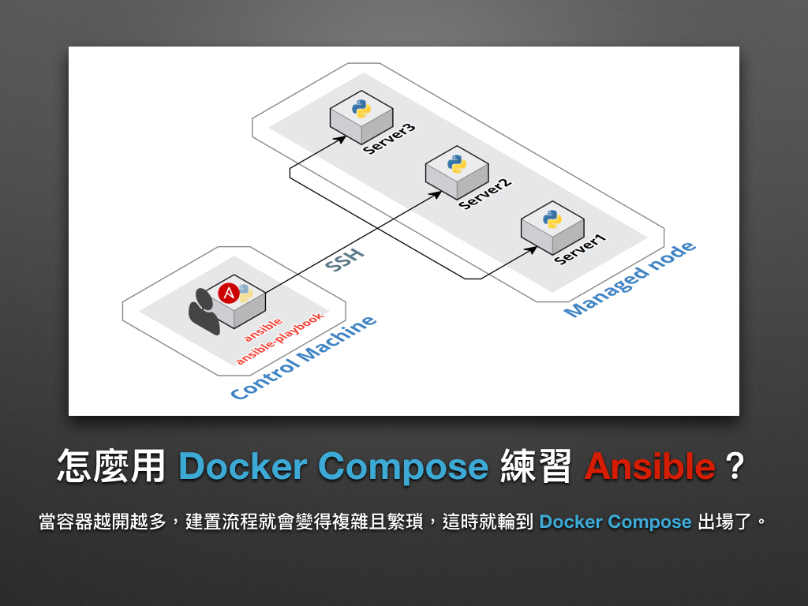
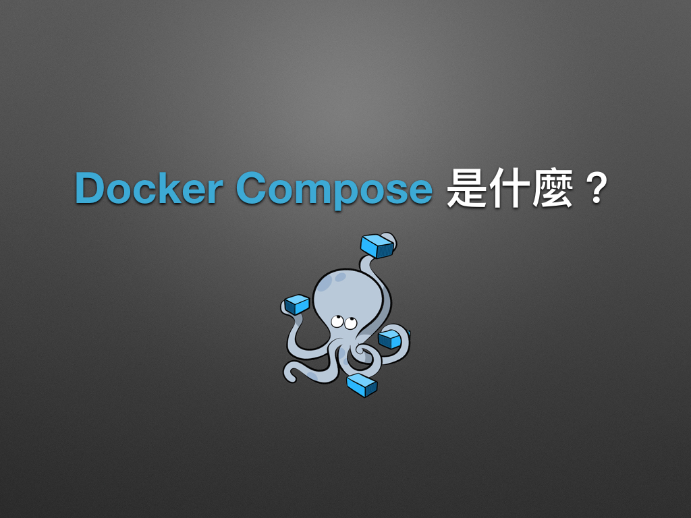
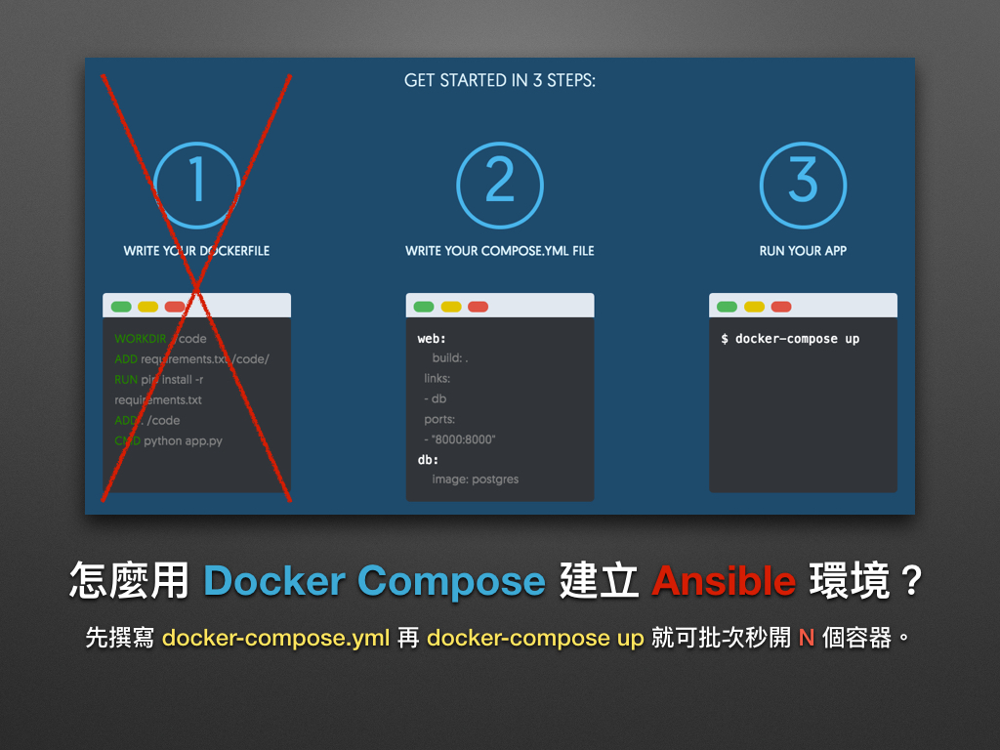
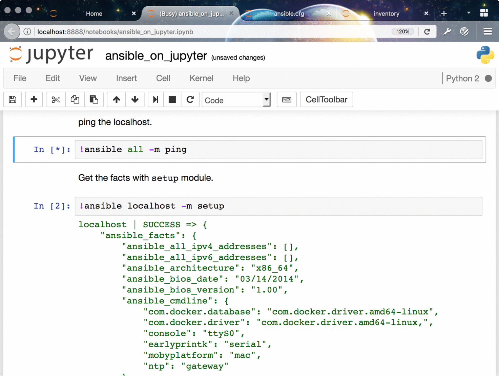

# 現代 IT 人一定要知道的 Ansible 自動化組態技巧

## 09. 怎麼用 Docker Compose 練習 Ansible？

在前一章「[08. 怎麼用 Jupyter 操控 Ansible？(Managed node)](08.how-to-practive-ansible-with-jupyter2.md)」我們藉由 Docker 實作用 **Control Machine** 和 **Managed node** 的環境。雖看似完美，可當容器一多就會讓建置環境的流程變得複雜且繁瑣，這次凍仁將改用 **Docker Compose** 來簡化練習 Ansible 的步驟。




### Docker Compose 是什麼？

[Docker Compose][docker_compose_official] 是個用來定義和執行複雜 Docker 應用程式的工具，它就好比 Shell Script 和 Ansible Playbooks，透過事先撰寫好的 `docker-compose.yml` 來批次管理 Docker 容器。



官網簡介如下：

> Docker Compose allows you to define your multi-container application with all of its dependencies in a single file, then spin your application up in a single command. 

若想深入了解 Docker Compose，可參考以下文章：

- [Docker Compose \| Docker][docker_compose_doc]
- [Docker Compose 项目 · Docker —— 从入门到实践][docker_compose_practice] 

[docker_compose_official]: https://www.docker.com/products/docker-compose
[docker_compose_doc]: https://docs.docker.com/compose/
[docker_compose_practice]: https://yeasy.gitbooks.io/docker_practice/content/compose/


### 怎麼用 Docker Compose 管理容器？

底下只列出本次主題所會用到的相關指令，練習時只需執行步驟 1, 2 即可。

1. 建立並執行容器。

  ```
  $ docker-compose up
  ```

2. 觀看容器狀態和綁定的埠口 (Port)。

  ```
  $ docker-compose ps
  ```

3. 關閉容器。

  ```
  $ docker-compose stop
  ```

4. 啟用容器。

  ```
  $ docker-compose start
  ```

5. 移除容器：再移除之前得先停用容器後才可移除。

  ```
  $ docker-compose rm -f

  # -f, --force: Don't ask to confirm removal
  ```

### 怎麼用 Docker Compose 建立 Ansible 環境？

上一章我們開了 3 個 Docker 容器來實作 **Control Machine** (Jupyter, Ansible) + **Managed node***2 (CentOS 7, Ubuntu 14.04) 的環境，這次就再加一個 **server3** 的 Managed node (Debian 8) 吧。


圖片來源： https://www.docker.com/products/docker-compose


#### 建立 `docker-compose.yml`

這次凍仁挑了 `chusiang/ansible-jupyter:alpine-3.4` 的 Docker image 作為 **Control Machine**，而新加入的 **Managed node** 則是用 `chusiang/ansible-managed-node:debian-8`。


```
$ vi docker-compose.yml
version: '2'
services:

  control_machine:
    ports:
      - 8888:8888/tcp
    image: chusiang/ansible-jupyter:alpine-3.4

  server1:
    ports:
      - 2221:22/tcp
    image: chusiang/ansible-managed-node:ubuntu-14.04

  server1:
    ports:
      - 2223:22/tcp
    image: chusiang/ansible-managed-node:centos-7

  server3:
    ports:
      - 2222:22/tcp
    image: chusiang/ansible-managed-node:debian-8
```

#### 啟動容器

使用 `docker-compose up` 來批次秒開所有的容器！

```
$ docker-compose up
Starting ch09_server2_1
Starting ch09_server1_1
Starting ch09_server3_1
Creating ch09_control_machine_1
Attaching to ch09_server3_1, ch09_server1_1, ch09_server2_1, ch09_control_machine_1
control_machine_1  | [I 22:29:59.156 NotebookApp] Writing notebook server cookie secret to /root/.local/share/jupyter/runtime/notebook_cookie_secret
control_machine_1  | [I 22:29:59.208 NotebookApp] Serving notebooks from local directory: /home
control_machine_1  | [I 22:29:59.209 NotebookApp] 0 active kernels
control_machine_1  | [I 22:29:59.209 NotebookApp] The Jupyter Notebook is running at: http://0.0.0.0:8888/
control_machine_1  | [I 22:29:59.210 NotebookApp] Use Control-C to stop this server and shut down allkernels (twice to skip confirmation).
...
```

#### 設定 Ansible 環境

這部份大多與前一章的 [08. 怎麼用 Jupyter 操控 Ansible？(Managed node)](08.how-to-practive-ansible-with-jupyter2.md) 重複，請特別留意 `inventory` 檔案的設置。


1. 取得本機的 IP：凍仁取得的 IP 為 `192.168.1.104`，請自行修改。

  ```
  # Ubuntu
  $ ifconfig eth0

  # macOS
  $ ifconfig en7
  ```

2. 取得 Managed node 容器所綁定的 OpenSSH port，請特別留意 `0.0.0.0:222?->22/tcp` 的部份。

  ```
  $ docker-compose ps
           Name                       Command               State           Ports
  ----------------------------------------------------------------------------------------
  ch09_control_machine_1   docker-entrypoint.sh jupyt ...   Up      0.0.0.0:8888->8888/tcp
  ch09_server1_1           /usr/sbin/sshd -D                Up      0.0.0.0:2221->22/tcp
  ch09_server2_1           /usr/sbin/sshd -D                Up      0.0.0.0:2223->22/tcp
  ch09_server3_1           /usr/sbin/sshd -D                Up      0.0.0.0:2222->22/tcp
  ```

3. 進入 Jupyter notebook 網站 ([http://localhost:8888/][jupyter_website])。
4. 若不想透過 Jupyter 操作 Ansible，可直接進入容器裡操作，但要記得切換到 `/home` 目錄底下。

  ```
  # 從 Host OS 進入容器。
  $ docker exec -it ch09_control_machine_1 sh
  / #

  # 切換目錄。
  / # cd /home

  # 列出 /home 底下的檔案。
  /home # ls -1
  ansible.cfg
  ansible_on_jupyter.ipynb
  inventory
  setup_jupyter.yml
  ```

5. 修改 `inventory` 檔案，並填入步驟 1 取得的 IP 和步驟 2 取得的 OpenSSH port。

  ```
  server1  ansible_ssh_host=192.168.1.104  ansible_ssh_port=2221
  server2  ansible_ssh_host=192.168.1.104  ansible_ssh_port=2222
  server3  ansible_ssh_host=192.168.1.104  ansible_ssh_port=2223
  ```

  > 請勿在這個 Lab 使用 localhost 和 127.0.0.1 的位址，這會讓 Control Machine 一直對自己找 Managed node。在這裡我們是把 Managed node 的 OpenSSH port 綁在 Host OS [^1] 上，而不是 Control Machine 的容器裡。

[jupyter_website]: http://localhost:8888/

6. 環境建置完成！現在可以到 Control Managed (Jupyter + Ansible) 上對各個 Managed node (Ubuntu 14.04, CentOS 7, Debian 8) 進行操作了。


### Play Ansible

現在我們可以透過 Ansible 操控 3 個 Managed node 了，記得把 inventory 的部份從 `localhost` 改成 `all` 喔！




### 後語

改用 Docker Compose 管理容器後，我們可以一次對所有的容器進行操作，相信對大家在實作較複雜的 Ansible 環境會有很大的幫助！

以上，希望大家會喜歡簡化過的 Docker Compose 流程。:D


### 相關連結

- [05. 怎麼用 Docker 練習 Ansible？](05.how-to-practive-ansible-with-docker.md)
- [`chusiang/ansible-jupyter` | Docker Hub][ansible_jupyter]
- [`chusiang/ansible-managed-node` | Docker Hub][ansible_managed_node]

[ansible_jupyter]: https://hub.docker.com/r/chusiang/ansible-jupyter/
[ansible_managed_node]: https://hub.docker.com/r/chusiang/ansible-managed-node/
