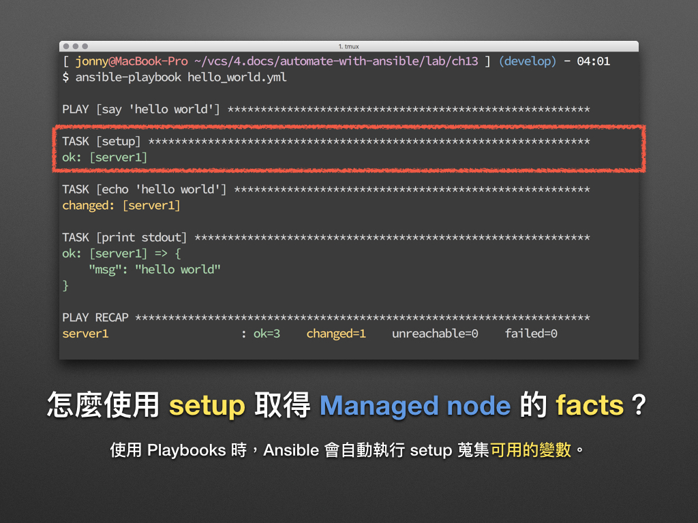

# 現代 IT 人一定要知道的 Ansible 自動化組態技巧

## 13. 怎麼使用 setup 取得 Managed node 的 facts？

使用 Playbooks 時，Ansible 會自動執行 [setup][setup_module] module 以蒐集各個 Managed node 的 **facts**。對凍仁而言這個 facts 就如同**系統變數**般的存在，從 IP 位址、作業系統、CPU 等資訊應有盡有。

[setup_module]: http://docs.ansible.com/ansible/setup_module.html



官方文件介紹如下：

> This module is automatically called by playbooks to gather useful variables about remote hosts that can be used in playbooks. It can also be executed directly by /usr/bin/ansible to check what variables are available to a host. Ansible provides many facts about the system, automatically.


### Ad-Hoc Commands

凍仁一般會先使用 Ad-Hoc Commands 呼叫 `setup` 看看有哪些用的上的資訊，這對撰寫些較複雜的 Playbooks 時是很有用的。

底下凍仁將使用 [`chusiang/ansible-managed-node:ubuntu-14.04`][ansible-managed-node] 這個 Docker image 作為 Managed node。

[ansible-managed-node]: https://hub.docker.com/r/chusiang/ansible-managed-node/

1. 藉由 less 快速搜尋所有的變數。[^1]

  ```
  $ ansible all -m setup | less
  server1 | SUCCESS => {
      "ansible_facts": {
          "ansible_all_ipv4_addresses": [
              "172.19.0.2"
          ],
          "ansible_all_ipv6_addresses": [
              "fe80::42:acff:fe13:2"
          ],
          "ansible_architecture": "x86_64",
          "ansible_bios_date": "03/14/2014",
          "ansible_bios_version": "1.00",
          "ansible_cmdline": {
              "com.docker.database": "com.docker.driver.amd64-linux",
              "com.docker.driver": "com.docker.driver.amd64-linux,",
              "console": "ttyS0",
              "earlyprintk": "serial",
              "mobyplatform": "mac",
              "ntp": "gateway"
          },
          "ansible_date_time": {
              "date": "2016-12-13",
  :
  ```

1. 搭配 `filter` 將發行版本 (distribution) 的資訊給過濾出來。

  ```
  $ ansible all -m setup -a "filter=ansible_distribution*"
  server1 | SUCCESS => {
      "ansible_facts": {
          "ansible_distribution": "Ubuntu",
          "ansible_distribution_major_version": "14",
          "ansible_distribution_release": "trusty",
          "ansible_distribution_version": "14.04"
      },
      "changed": false
  }
  ```

1. 取得套件管理員的種類資訊，此例取得的值為 **apt**。

  ```
  $ ansible all -m setup -a "filter=ansible_pkg_mgr"
  server1 | SUCCESS => {
      "ansible_facts": {
          "ansible_pkg_mgr": "apt"
      },
      "changed": false
  }
  ```

### 撰寫跨 Linux distribution 的 Playbooks

取得 `ansible_pkg_mgr` 後，我們可以 Playbooks 裡加個判斷式使用。

1. 建立支援 Debian, Ubuntu, CentOS 安裝 Vim 的 playbook。

  ```
  $ vim setup_vim.yml
  ---
  
  - name: Setup the vim 
    hosts: all
    become: true
    tasks:
  
      # Debian, Ubuntu.
      - name: install apt packages
        apt: name=vim state=present
        when: ansible_pkg_mgr == "apt"
  
      # CentOS.
      - name: install yum packages
        yum: name=vim-minimal state=present
        when: ansible_pkg_mgr == "yum"
  
  # vim:ft=ansible :
  ```

1. 執行 playbook，且當條件不符時，即會跳過該 task。。

  ```
  $ ansible-playbook setup_vim.yml
  
  PLAY [Setup the vim] **************************************************
  
  TASK [setup] **********************************************************
  ok: [server1]
  
  TASK [install apt packages] *******************************************
  changed: [server1]
  
  TASK [install yum packages] *******************************************
  skipping: [server1]
  
  PLAY RECAP ************************************************************
  server1           : ok=2    changed=1    unreachable=0    failed=0
  ```


### 後語

`setup` module 是每位 Ansibler 一定會接觸到的！我們可以善加利用它，並與各種需求搭配使用，這樣會讓 Playbooks 更具彈性且易於維護。


### 相關連結

- [chusiang.vim-and-vi-mode | Ansible Galaxy][chusiang.vim-and-vi-mode]
- [怎麼用 filter 取得 setup 的第 2 層值？ | ansible-tw/AMA][ansible_tw_ama_1]

[chusiang.vim-and-vi-mode]: https://galaxy.ansible.com/chusiang/vim-and-vi-mode/
[ansible_tw_ama_1]: https://github.com/ansible-tw/AMA/issues/1


[^1]: 在 less 裡我們可使用 `/` + 關鍵字 + `Enter` 進行搜尋。
 
