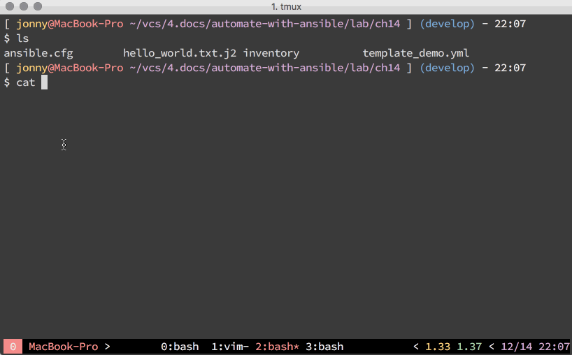
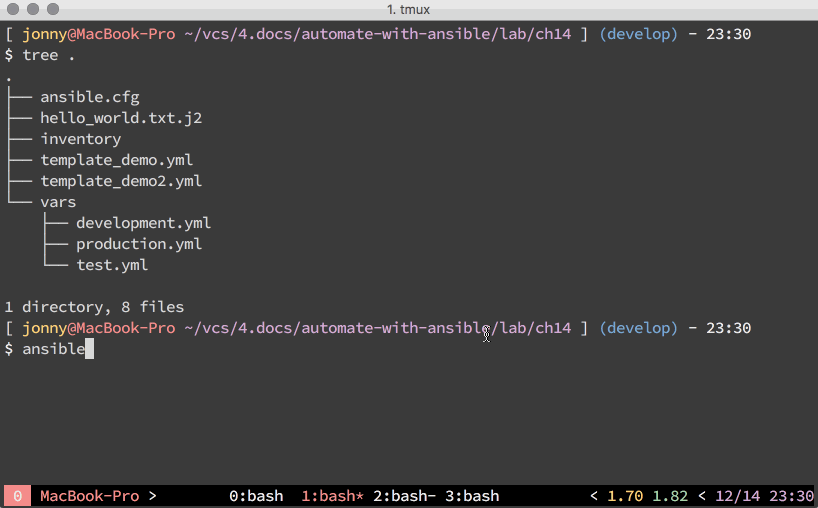

# 現代 IT 人一定要知道的 Ansible 自動化組態技巧

## 14. 怎麼使用 Ansible 的 Template 系統？

[template][template_module] module 是凍仁常用的檔案模組 (Files Modules) 之一，先前在「[12. 常用的 Ansible Module 有哪些？](12.which-are-the-commonly-used-modules.md)」一章時，也曾提到可以用它和變數 (Variables) 來操作檔案。

[template_module]: http://docs.ansible.com/ansible/template_module.html


圖片來源：http://www.freeiconspng.com/free-images/txt-file-icon-1203

我們只需事先定義變數和模板 (Templates)，即可用它動態產生遠端的 Shell Scripts、設定檔 (Configure) 等。換句話說，我們可以用一份 template 來產生開發 (Development)、測試 (Test) 和正式環境 (Production) 等不同的環境設定。


### 舉例說明

說了那麼多，還是讓凍仁舉個小例子說明吧！

1. 建立 template 檔案。

  ```
  $ vi hello_world.txt.j2
  Hello "{{ dynamic_word }}"
          ↑ ↑ ↑
  ```

  - 由於 Ansible 是藉由 [Jinja2](http://jinja.pocoo.org/) 來實作 template 系統，所以請使用 `*.j2` 的副檔名。
  - 上面的 `"{{ dynamic_word }}"` 代表我們在此 template 裡使用了名為 `dynamic_word` 的變數。

1. 建立 playbook，並加入變數。

  ```
  $ vi template_demo.yml
  ---
  - name: Play the template module
    hosts: localhost
    vars:
      dynamic_word: "World"
  
    tasks:
      - name: generation the hello_world.txt file
        template:
          src: hello_world.txt.j2
          dest: /tmp/hello_world.txt
  
      - name: show file context
        command: cat /tmp/hello_world.txt
        register: result
  
      - name: print stdout
        debug:
          msg: "{{ result.stdout_lines }}"
  
  # vim:ft=ansible :
  ```

  - 在第 6 行，我們幫 `dynamic_word` 變數設了一個預設值 `World`。
  - 在第 9 行的第 1 個 task 裡，我們使用了 template module，並指定了檔案的來源 (src) 和目的地 (dest)。
  - 之後的 2 個 tasks 則是把 template module 產生出來的檔案給印出來。

1. 執行 playbook。

  

  - 直接執行 playbook。

      ```
      $ ansible-playbook template_demo.yml
      ```

  - 透過 `-e` 參數將 `dynamic_word` 覆寫成 ansible。 

      ```
      $ ansible-playbook template_demo.yml -e "dynamic_word=ansible"
      ```

  - 透過 `-e` 參數將 `dynamic_word` 覆寫成 Day14。 

      ```
      $ ansible-playbook template_demo.yml -e "dynamic_word=Day14"
      ```


### 怎麼讓 Playbooks 切換環境？

1. 在 Playbooks 裡除了用 `vars` 來宣告變數以外，還可以用 [`vars_files`][vars_files] 來 include 其它的變數檔案。

  ```
  $ vi template_demo2.yml
  ---
  - name: Play the template module
    hosts: localhost
    vars:
      env: "development"

    vars_files:
      - vars/{{ env }}.yml

    tasks:
      - name: generation the hello_world.txt file
        template:
          src: hello_world.txt.j2
          dest: /tmp/hello_world.txt
  
      - name: show file context
        command: cat /tmp/hello_world.txt
        register: result
  
      - name: print stdout
        debug:
          msg: "{{ result.stdout_lines }}"

  # vim:ft=ansible :
  ```

1. 建立 `vars/development.yml`, `vars/test.yml` 和 `vars/production.yml` 檔案，接下來將依不同的環境 include 不同的變數檔案 (vars files)，這樣就可以用同一份 playbook 切換環境了！

  - Development

      ```
      $ vi vars/development.yml
      dynamic_word: "development"
      ```

  - Test

      ```
      $ vi vars/test.yml
      dynamic_word: "test"
      ```

  - Production

      ```
      $ vi vars/production.yml
      dynamic_word: "production"
      ```

1. 執行 playbook，並透過 `-e` 切換各個環境。

  

[vars_files]: http://docs.ansible.com/ansible/playbooks_variables.html#variable-file-separation


### 後語

template 系統是實務上很常見的手法之一，藉由它我們可以很輕鬆的讓開發、測試和正式環境無縫接軌。

現在是不是有**寫 code 管機器**的感覺了呢？(笑)


### 相關連結

- [Playbook variables ignored when used vars_files + ansible_os_family · Issue #8638 · ansible/ansible | GitHub](https://github.com/ansible/ansible/issues/8638)

