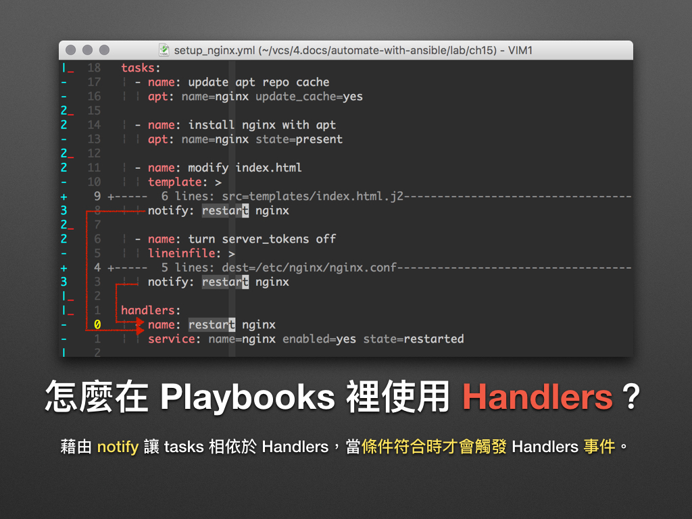
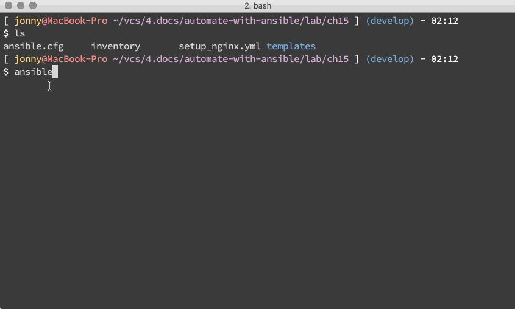

# 現代 IT 人一定要知道的 Ansible 自動化組態技巧

## 15. 怎麼在 Playbooks 使用 Handlers？

[Handlers][playbooks_handlers] 是我們在 Ansible Playbooks 裡很常用來重開系統服務 (Service) 的手法，大家可以在不少前人分享的 Playbooks 裡看見它的蹤跡，這裡凍仁將透過安裝 Nginx 的 Playbook 來介紹它。

[playbooks_handlers]: http://docs.ansible.com/ansible/playbooks_intro.html#handlers-running-operations-on-change




### Handlers 是什麼？

Handler 本身是一種非同步的 callback function [^1]；在這裡則是指關連於特定 tasks 的事件 (event) 觸發機制。當這些特定的 tasks 狀態為**被改變 (changed)** 且都已被執行時，才會觸發一次 event。

以上圖為例，要觸發 `restart nginx` 這個 handler，需符合以下條件：

1. `modify index.html` 或 `turn server_tokens off` 兩個 tasks 中，至少有一個狀態為 **changed**。
1. 所有關連到 `restart nginx` handler 的 tasks 都已被執行。 [^2]


### 怎麼使用 Handlers？

底下凍仁將透過部署 Nginx 的 Playbook 為例。

1. 建立 ansible.cfg。

  ```
  $ vi ansible.cfg
  [defaults]

  hostfile = inventory
  remote_user = docker
  private_key_file = ~/.ssh/id_rsa
  host_key_checking = False
  retry_files_save_path = ./ansible-retry
  ```

1. 建立 inventory file。

  ```
  $ vi inventory
  server1  ansible_ssh_host=192.168.1.104  ansible_ssh_port=2221
  ```

1. 建立 setup_nginx.yml。

  ```
  $ vi setup_nginx.yml
  ---

  - name: setup the nginx
    hosts: all
    become: true
    vars:
      username: "ironman"
      mail: "chusiang (at) drx.tw"
      blog: "http://note.drx.tw"

    tasks:
      # 執行 'apt-get update' 指令。
      - name: update apt repo cache
        apt: name=nginx update_cache=yes

      # 執行 'apt-get install nginx' 指令。
      - name: install nginx with apt
        apt: name=nginx state=present

      # 於網頁根目錄 (DocumentRoot) 編輯 index.html。
      - name: modify index.html
        template: >
          src=templates/index.html.j2
          dest=/usr/share/nginx/html/index.html
          owner=www-data
          group=www-data
          mode="644"
          backup=yes
        notify: restart nginx

      # (security) 關閉 server_tokens：移除 server_tokens 前的 '#' 字元。
      - name: turn server_tokens off
        lineinfile: >
          dest=/etc/nginx/nginx.conf
          regexp="server_tokens off;"
          insertafter="# server_tokens off;"
          line="server_tokens off;"
          state=present
        notify: restart nginx

    # handlers 
    #
    # * 當確認事件有被觸發才會動作。
    # * 一個 handler 可被多個 task 通知 (notify)，並於 tasks 跑完才會執行。
    handlers:
      # 執行 'sudo service nginx restart' 指令。
      - name: restart nginx
        service: name=nginx enabled=yes state=restarted

    # post_tasks:
    #
    # 在 tasks 之後執行的 tasks。
    post_tasks:
      # 檢查網頁內容。
      - name: review http state
        command: "curl -s http://localhost"
        register: web_context

      # 印出檢查結果。
      - name: print http state
        debug: msg={{ web_context.stdout_lines }}

  # vim:ft=ansible :
  ```

  1. 在第 47 行裡，我們建立了一個 `restart nginx` handler。
  1. 在修改到 Nginx 設定檔的 tasks (`modify index.html`, `turn server_tokens off`) 裡，使用 `notify` 通知 handlers (`restart nginx`) 說這些 Tasks 要進行關連。
  1. 最後在 `post_tasks` 裡建了 2 個 tasks，讓它們可以在一般的 tasks 結束後才執行。

1. 建立 Nginx vhost 的 template：請參考前一篇的「[14. 怎麼使用 Ansible 的 Template 系統？](14.how-to-use-the-ansible-template-system.md)，凍仁就不在此多加詳述。

  ```
  $ mkdir templates && vi templates/index.html.j2
  <!DOCTYPE html>
  <html>
    <head>
      <meta charset="UTF-8">
      <title>Day15 demo | automate-with-ansible</title>
    </head>
    <style type="text/css" media="all">
      body {
        font-size: x-large;
      }
    </style>
    <body>
      <p>
  <pre>[ {{ username }}@automate-with-ansible ~ ]$ hostname
  automate-with-ansible.drx.tw
  [ {{ username }}@automate-with-ansible ~ ]$ cowsay "This is a ansible-playbook demo for automate-with-ansible at 2016/12/15."
   _____________________________________
  / This is a ansible-playbook demo for \
  \ automate-with-ansible at 2016/12/15./
   -------------------------------------
          \   ^__^
           \  (oo)\_______
              (__)\       )\/\
                  ||----w |
                  ||     ||
  [ {{ username }}@automate-with-ansible ~ ]$
  [ {{ username }}@automate-with-ansible ~ ]$
  [ {{ username }}@automate-with-ansible ~ ]$ cat .profile
  - {{ mail }}
  - {{ blog }}</pre>
      </p>
    </body>
  </html>
  ```

  - 在這份 index.html.j2 裡，我們用了 `username`, `mail` 和 `blog` 三個變數，其值會從 `setup_nginx.yml` 中代入。

1. 執行 Playbook。

  

  - 試著多跑幾次，就會發現當 `modify index.html` 和 `turn server_tokens off` tasks 的狀態不為 changed 時，該 handler 不會被觸發的差異。
  - 在此例中，我們可以藉由修改 Playbook 裡的變數 (vars) 來重複觸發 handler，例如把 `username` 從 `ironman` 修改成 `root`。


### 後語

雖然我們可以在 tasks 的最後加個 task 來重開 web service，可當與 web service 相關的 tasks 的狀態皆為 ok 時，這種寫法會讓 web service 再次被重開。

透過 Handlers 我們可以**只在需要時重開**一次，進而**減少服務中斷的時間**。


## 相關連結

- [Intro to Playbooks | Ansible Documentation](http://docs.ansible.com/ansible/playbooks_intro.html)
- [Playbooks 介紹 | Ansible 中文權威指南](http://ansible-tran.readthedocs.io/en/latest/docs/playbooks_intro.html)
- [響應事件 (Handler) | Ansible入門](https://ansible-book.gitbooks.io/ansible-first-book/content/handler.html)


[^1]: 維基百科對於 Handler 的解釋為 *An asynchronous callback (computer programming) subroutine in computing*，詳情請參考 [Handler | Wikipedia](https://en.wikipedia.org/wiki/Handler) 一文。

[^2]: 一般都會用 Tasks 通知 (notify) Handlers 來述敘兩者的關係，但凍仁比較喜歡用 Tasks 關連於 Handlers 的說法。
