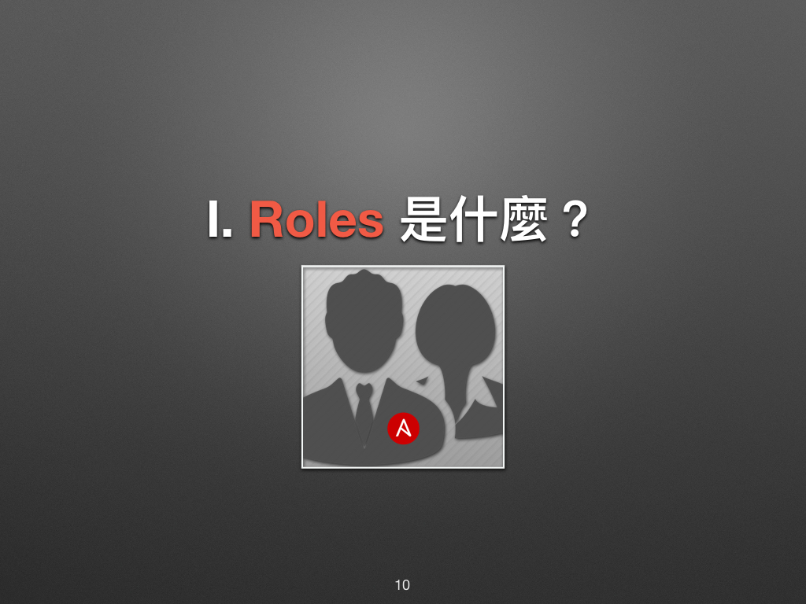
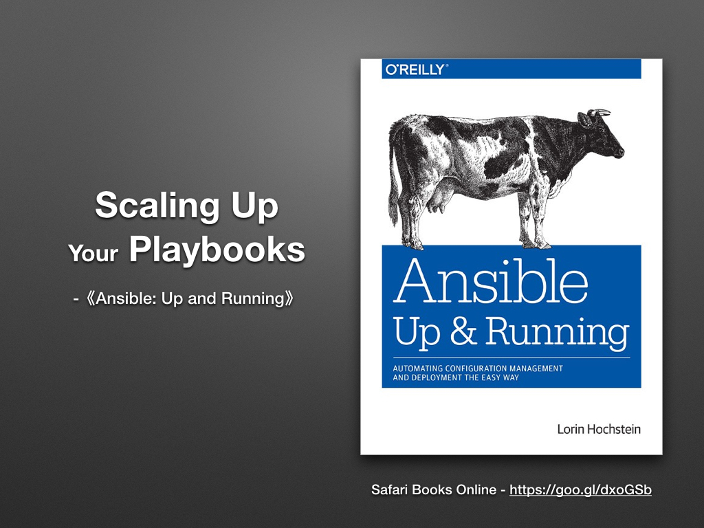
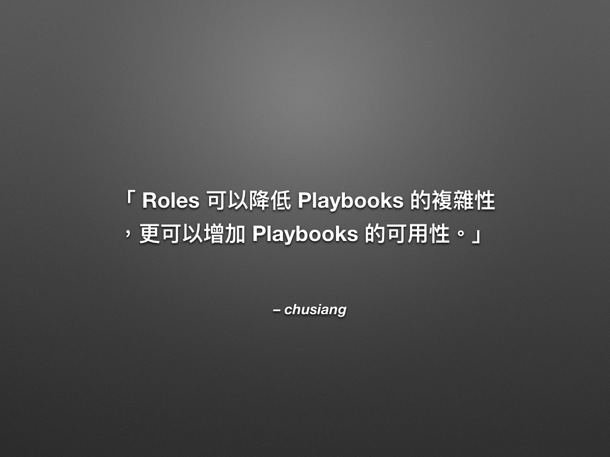
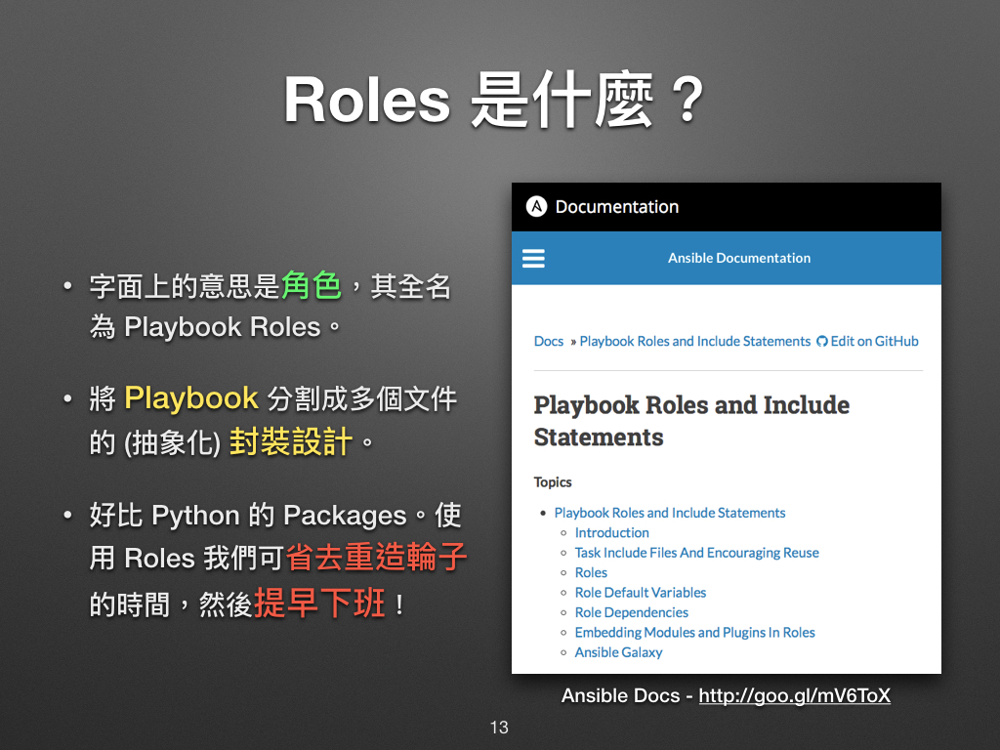
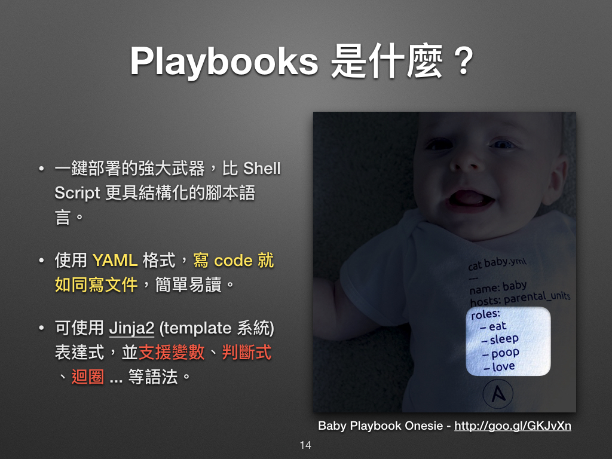
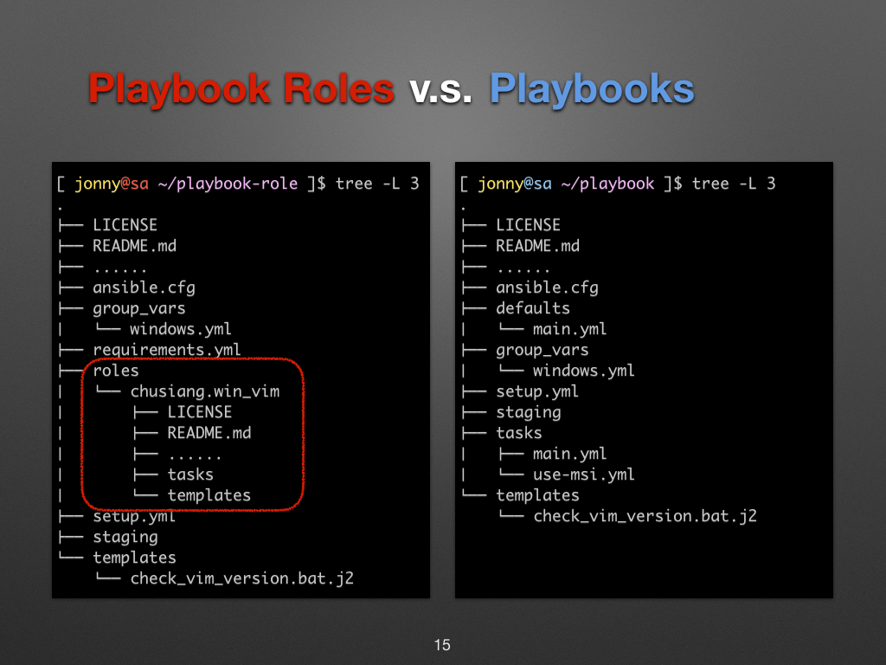

# 現代 IT 人一定要知道的 Ansible 自動化組態技巧

## 20. Roles 是什麼？

在上一章「[19. 如何維護複雜的 Ansible Playbooks？](19.how-to-maintain-the-complex-playbooks.md)」凍仁提到 Roles 很重要、很好用！這章凍仁就來介紹可讓我們加速升空的火箭 (Rocket) [^1] 吧！



在 [《Ansible: Up and Running》][ansiblebook] 一書的第 8 章開頭就寫明了，我們可以用 Roles 來擴充 Playbooks。

[ansiblebook]: http://www.ansiblebook.com


資料來源：https://goo.gl/dxoGSb

如果要用一句話來解釋 Roles，那凍仁會這麼說：

**「Roles 可以降低 Playbooks 的複雜性，更可以增加 Playbooks 的可用性。」**



[Roles][playbooks_roles] 就字面上來說有角色、作用的意思，但它的全名其實是 Playbooks Roles，我們可把它當成是 Playbooks 的延伸使用。 

[playbooks_roles]: http://docs.ansible.com/ansible/playbooks_roles.html

在前一章裡，我們雖已把重複的 Tasks 獨立出來，但光只有這樣是無法分享給其它專案 (Project) [^2] 使用的。在 Python 的世界裡，我們會把寫好的程式**封裝**成**套件 (Packages)** 並**分享**給他人使用，而**在 Ansible 的世界裡，我們會用 Roles 來形容這個偉大的行為**。



早在「[06. 怎麼操作 Ansible？](06.how-to-use-the-ansible.md)」一章講解 Playbooks 時，就已出現過 Roles 的蹤影了。

> 「寶寶身上有 Roles 只是寶寶不說。」


圖片來源：http://goo.gl/GKJvXn

比對一下 Roles 和 Playbooks 的目錄結構，可以看到前者多了 `roles/` 目錄和 `chusiang.win_vim` 的 role。




### Role 的基本結構

接下來凍仁將藉由這個簡單的 `example_role` 來介紹 Role 的檔案架構。

```
$ tree .
.
└── example_role
    ├── README.md     # 說明文件
    ├── defaults
    │   └── main.yml  # 可被覆寫的變數。
    ├── files         # 需複製到 Managed node 的檔案。
    ├── handlers
    │   └── main.yml  # 主要的 handler。
    ├── meta
    │   └── main.yml
    ├── tasks
    │   └── main.yml  # 主要的 task。
    ├── templates     # 集中存放 Jinja2 模板的目錄。
    ├── tests
    │   ├── inventory
    │   └── test.yml
    └── vars
        └── main.yml  # 不該被覆寫的變數。

9 directories, 8 files
```

關於 Roles 的基本介紹就到這裡，下一章凍仁將介紹怎麼使用 Roles？

到目前為止，不知大家是否跟上凍仁的腳步了呢？如果有問題，可以在下方留言，凍仁會抽空回答的。


### 相關連結

- [Ansible: Up and Running — an O’Reilly book by Lorin Hochstein][ansiblebook]
- [PyPI - the Python Package Index | Python][pypi]
- [Python Tutorial 第二堂（3）函式、模組、類別與套件 by caterpillar | CodeData][python_package]

[pypi]: https://pypi.python.org/pypi
[python_package]: http://www.codedata.com.tw/python/python-tutorial-the-2nd-class-3-function-module-class-package/

[^1]: 當您駕御 Roles 後，就會有如搭上 Rocket 般的一飛衝天！ 

[^2]: 這裡指的專案是指一個擁有很多 Playbook 的 Playbooks，可以把它想成是 Chef 的 Cookbooks 或者是 Java 的 Project。

