# 現代 IT 人一定要知道的 Ansible 自動化組態技巧

## 27. 怎麼用 Travis CI 測試 Roles？

在「[好的 Roles 應具備什麼？](25.how_to_share_roles_on_galaxy-1.md#好的-roles-應具備什麼)」一節裡，凍仁曾提過好的 Roles 應加入 **[Travis CI][travis_ci_official]** 自動化測試，本章將以 [`chusiang.helloworld`][chusiang_helloworld_galaxy] role 為例。

[travis_ci_official]: https://travis-ci.org/

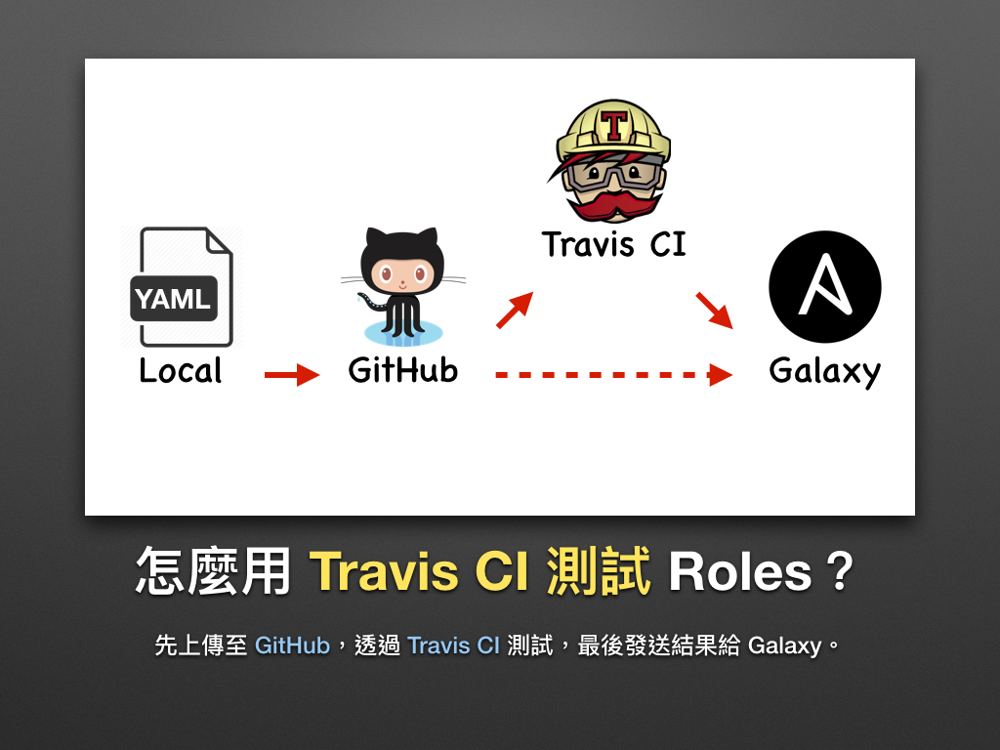

[chusiang_helloworld_galaxy]: https://galaxy.ansible.com/chusiang/helloworld/
[chusiang_helloworld_github]: https://github.com/chusiang/helloworld.ansible.role

1. 撰寫一個 Role，並上傳至 [GitHub][chusiang_helloworld_github]。
  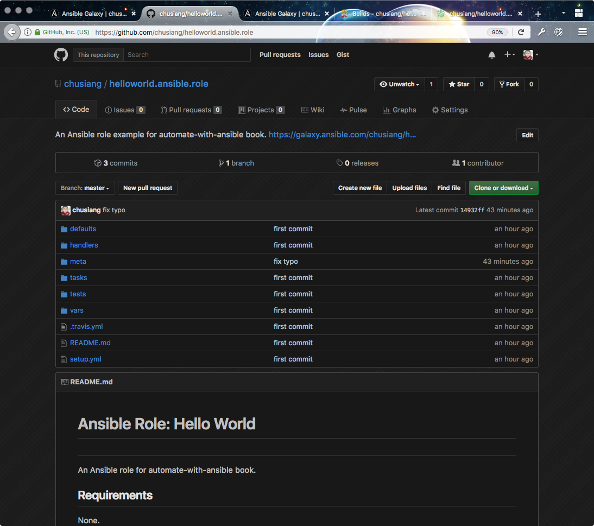

1. 於 Galaxy 網站進行匯入，詳請請參考「[怎麼在 Galaxy 匯入 Roles？](26.how_to_share_roles_on_galaxy-2.md#怎麼在-galaxy-匯入-roles)」一節。
  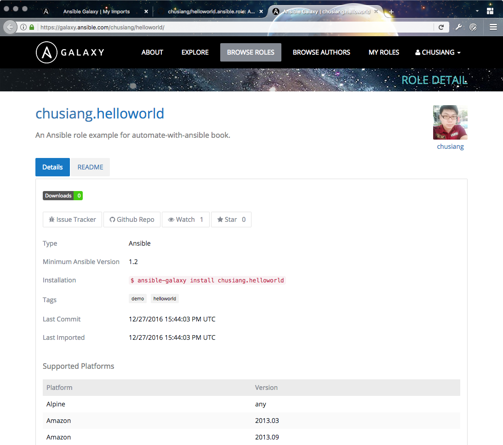

1. 進入 [Travis CI][travis_ci_official] 網站。
  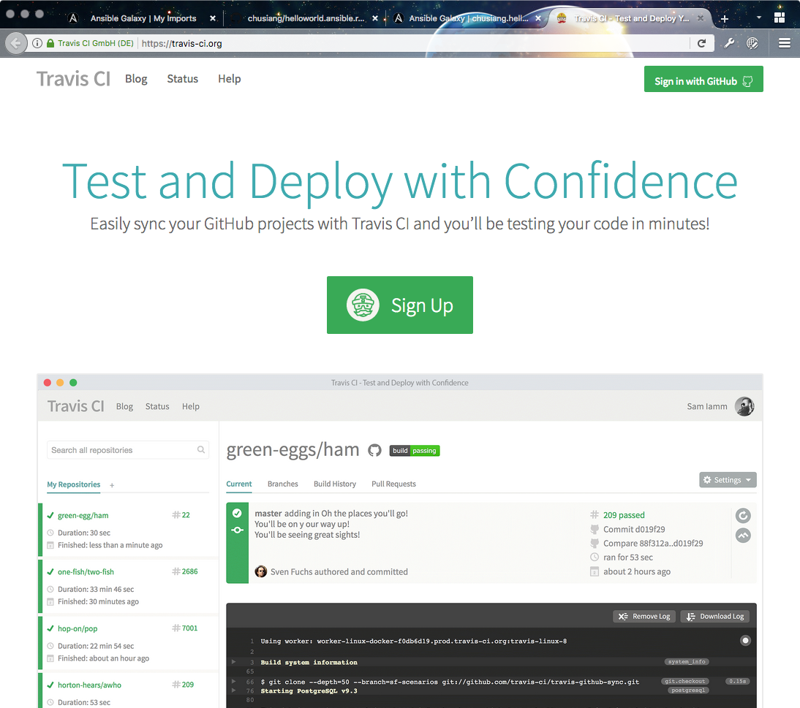

1. 點擊左上角的 **✚** 整合新 Repository。
  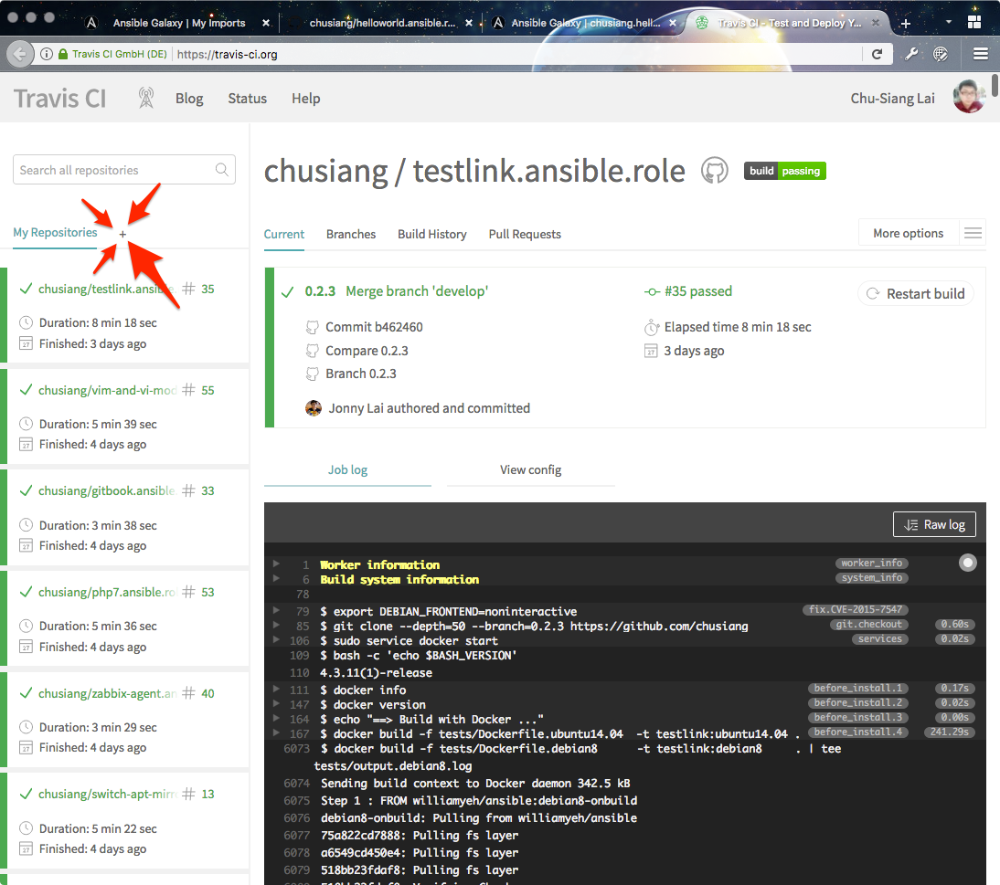

1. 只需三個步驟即可整合 Travis CI。
  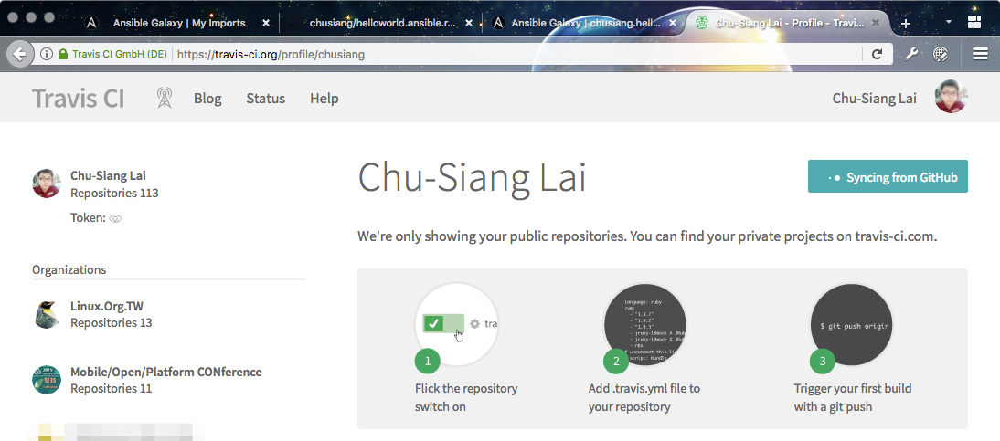
  1. 將左方的開關切換至 on。
  1. 於 Git Repository 裡新增 `.travis.yml`。
  1. 使用 `git push` 即會觸發 Travis CI。

1. `chusiang.helloworld/.travis.yml` 的內容如下。

  ```yaml
  ---
  language: python
  python: "2.7"
  
  # Use the new container infrastructure
  sudo: false
  
  # Install ansible
  addons:
    apt:
      packages:
      - python-pip
  
  install:
    # Install ansible
    - pip install ansible
  
    # Check ansible version
    - ansible --version
  
    # Create ansible.cfg with correct roles_path
    - printf '[defaults]\nroles_path=../' >ansible.cfg
  
  script:
    # Basic role syntax check
    - ansible-playbook tests/test.yml -i tests/inventory --syntax-check
  
  notifications:
    webhooks: https://galaxy.ansible.com/api/v1/notifications/
  ```

  - 此例用了 `--syntax-check` 參數進行基本的語法檢測，較進階的作法則是藉由 Docker 進行測試。
  - 使用 `notifications` 和 `webhooks` 發送通訊給 Galaxy。 [^1]

1. 將範例 Role 左方的開關切至 on 以整合 Travis CI。
  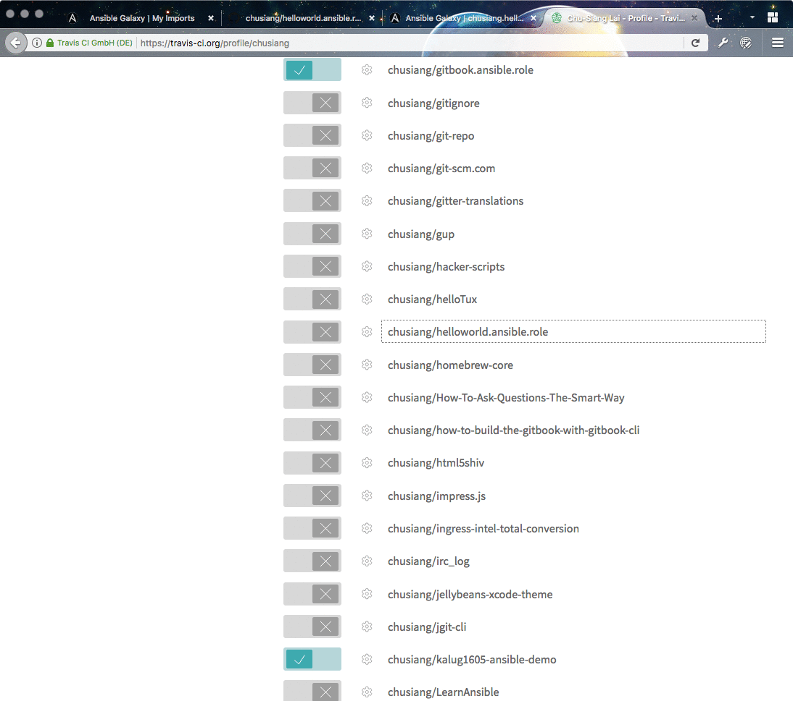

1. 建立完畢，等待觸發，這時的 build state 會是 **unknown**。
  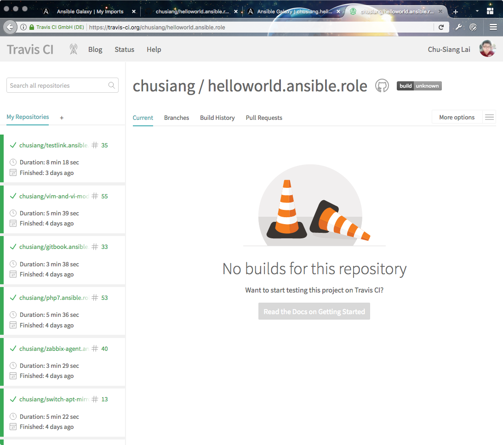

1. 使用 `git push` 到 GitHub 後，Travis CI 會自動觸發。
  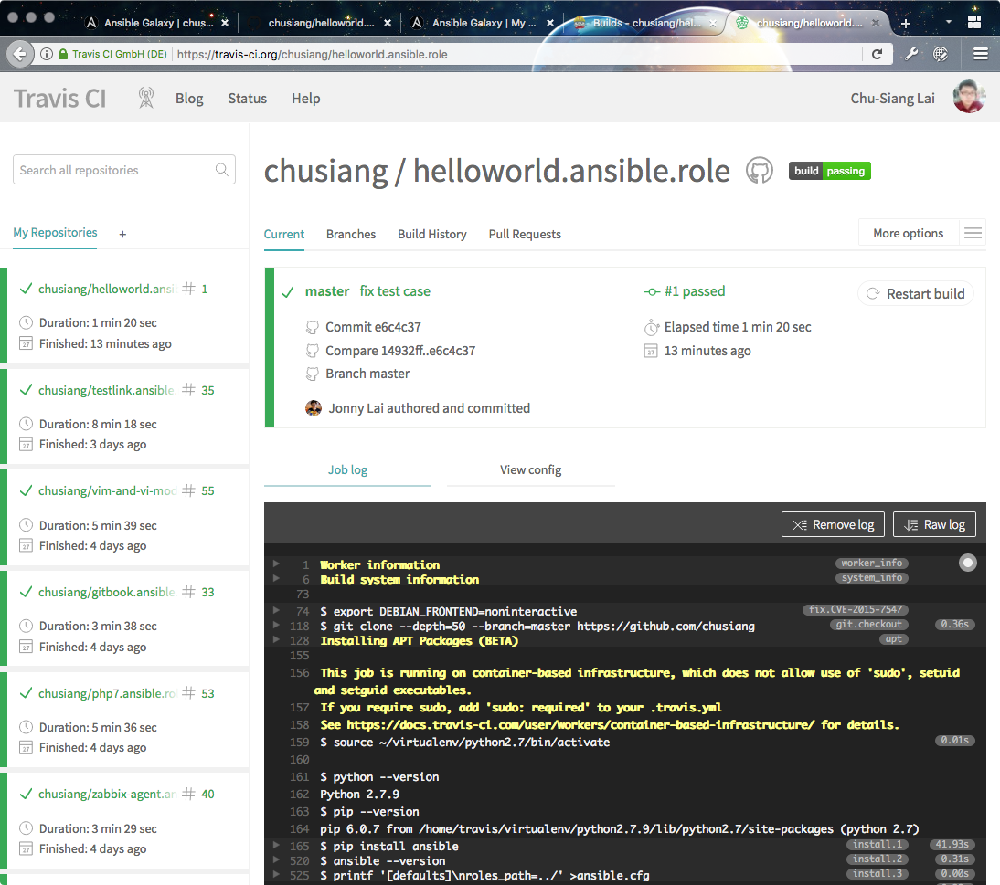

1. 若想把 **build state** 的 badge 放入 `README.md`，可點擊該 badge 獲得各式語法。
  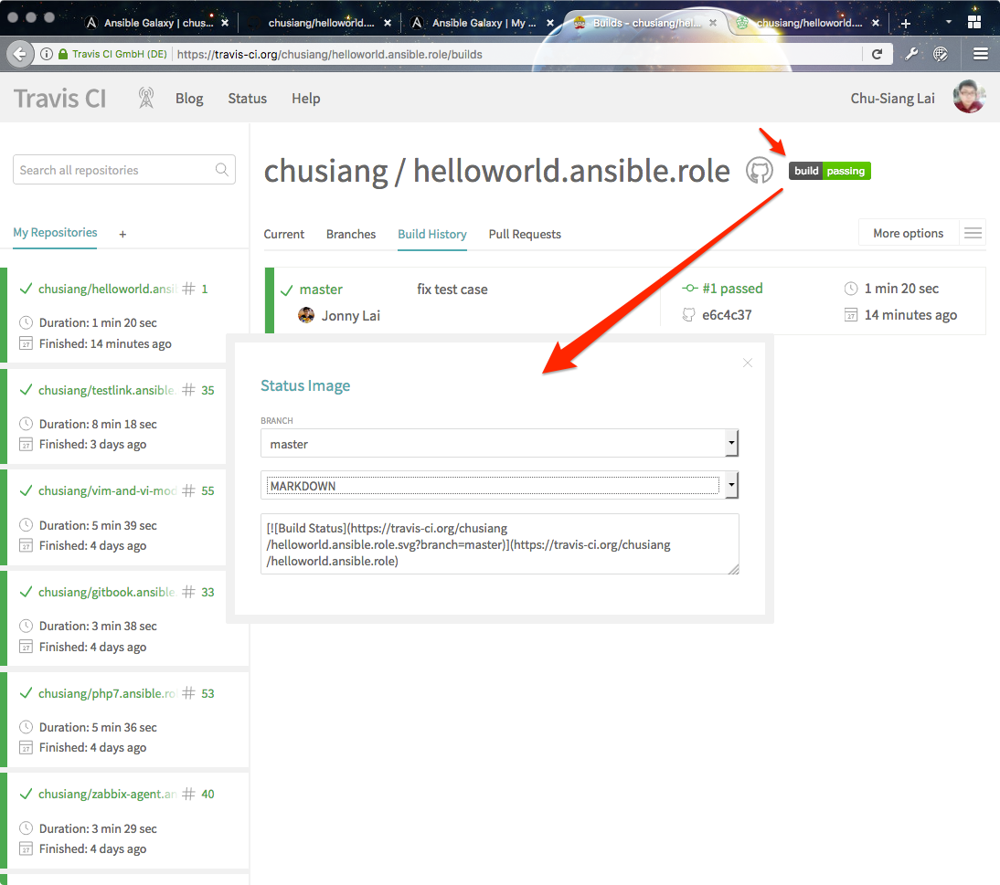

1. 回到 Galaxy 網站，會發現多了 **build state** 的 badge。
  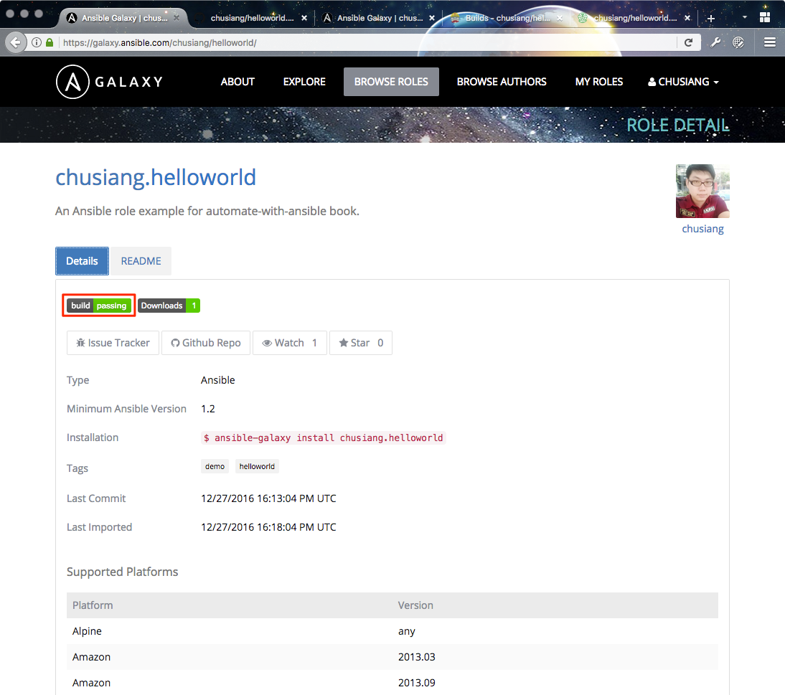

以上，恭喜您學會了在 Roles 加入 Travis CI 自動化測試的技能。

> 凍仁提醒您：「當 **build state** badge 顯示 **fail** 時，記得回頭修一下 Roles 喔！」


### 相關連結

- [Automated Testing | Ansible Galaxy][ansible_galaxy_automated_testing]

[ansible_galaxy_automated_testing]: https://galaxy.ansible.com/intro#travis


[^1]: 凍仁半年前剛使用 Galaxy 和 Travis CI 時，要讓 Travis CI 發通知到 Galaxy，除了 `.travis.yml` 要寫 `notifications`，還需手動於 Galaxy 設置 Travis CI 的 Token；而現在已不需額外設置 Travis CI Token 了。

