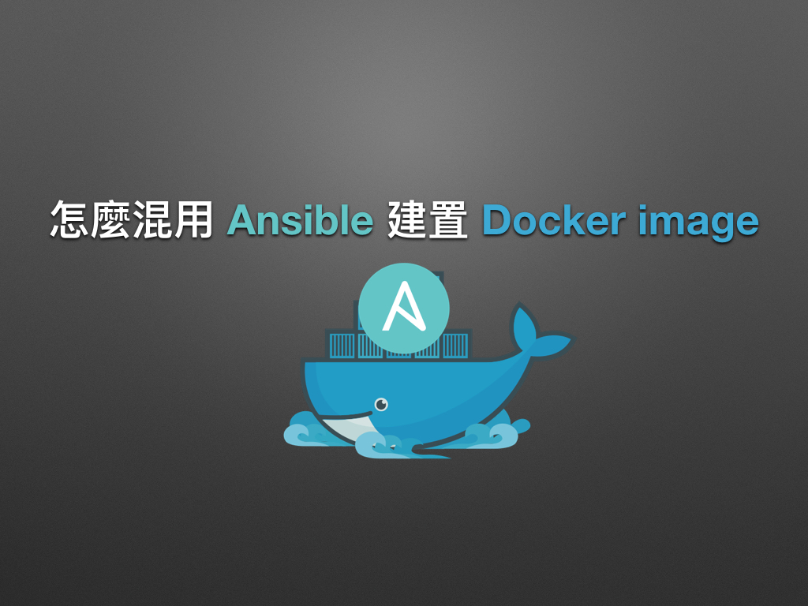

# 現代 IT 人一定要知道的 Ansible 自動化組態技巧

## 28. 怎麼混用 Ansible 建置 Docker image？

在「[05. 怎麼用 Docker 練習 Ansible？](05.how-to-practive-the-ansible-with-docker.md)」一章時，曾提到可以用 Ansible 建置 Docker image。接下來凍仁將藉由 `chusiang.vim-and-vi-mode` role 講解 Dockerize (Docker 化) Ansible role 的小技巧。

[chusiang_vim_role]: https://galaxy.ansible.com/chusiang/vim-and-vi-mode/




### chusiang.vim-and-vi-mode 是什麼？

[`chusiang.vim-and-vi-mode`][chusiang_vim_role] 是用來安裝 Vim 和設置 vi-mode 的 Ansible Role，目前支援的平台有 Ubuntu, Debian, CentOS 和 macOS。

- Galaxy: https://galaxy.ansible.com/chusiang/vim-and-vi-mode/
- GitHub: https://github.com/chusiang/vim-and-vi-mode.ansible.role/

> 對於凍仁這位 Vim 重度使用者而言，會想在各個環境都使用 vi-mode，索性就寫了一個 Role 來處理這些索碎的操作。


#### 檔案結構

與之前 Roles 的範例相比，這次多了 `builds/` 目錄和各個發行版本的 `Dockerfile`。

```
$ tree .
.
├── LICENSE
├── README.md
├── Vagrantfile
├── builds
│   ├── centos6
│   │   └── Dockerfile
│   ├── centos7
│   │   └── Dockerfile
│   ├── debian7
│   │   └── Dockerfile
│   ├── debian8
│   │   └── Dockerfile
│   ├── ubuntu14.04
│   │   └── Dockerfile
│   └── ubuntu16.04
│       └── Dockerfile
├── defaults
│   └── main.yml
├── meta
│   └── main.yml
├── setup.yml
├── tasks
│   ├── main.yml
│   ├── use-apt.yml
│   ├── use-brew.yml
│   └── use-yum.yml
├── templates
│   └── gitconfig.j2
└── ...
```

### 怎麼建置 Docker image？

#### 建立 Dockerfile

`Dockerfile` 是我們使用 `docker build` 指令建置 image 會用到的檔案。這邊只以 Ubuntu 14.04 的 Dockerfile 進行解說，如想深入了解還請參考 [Dockerfile reference | Docker][dockerfile_reference] 一文。

[dockerfile_reference]: https://docs.docker.com/engine/reference/builder/

```
$ vi builds/ubuntu14.04/Dockerfile
01 # pull base image
02 FROM williamyeh/ansible:ubuntu14.04-onbuild
03 MAINTAINER Chu-Siang Lai <chusiang.lai@gmail.com>
04 
05 #
06 # build phase
07 #
08 RUN sed -i -e 's/exit\s\s*101/exit 0/' /usr/sbin/policy-rc.d
09 
10 # init.
11 RUN sudo apt-get install -y curl git make ;\
12       git clone https://github.com/chusiang/vim-and-vi-mode.ansible.role.git ;\
13       cd vim-and-vi-mode.ansible.role
14 
15 ENV PLAYBOOK vim-and-vi-mode.ansible.role/setup.yml
16 RUN ansible-playbook-wrapper -vvv
```

1. 第 2 行：宣告上層 docker image 的來源為 `williamyeh/ansible:ubuntu14.04-onbuild`。
1. 第 11-13 行：執行安裝 `curl`, `git`, `make` 套件和取得 Playbooks 等事先作業。
1. 第 15 行：設置 playbook 路徑。
1. **第 16 行：用 Ansible 處理後續的組態任務。**


#### 建置 Docker image

有了 Dockerfile，我們就可藉由 `docker build` 指令建置 docker imgae。

1. 進入 `builds/ubuntu14.04/` 的目錄。

  ```
  $ cd builds/ubuntu14.04
  ```

1. 建置 docker image。

  ```
  $ docker build -t vim:ubuntu14.04 .
  ...
  PLAY RECAP *********************************************************************
  localhost                  : ok=10   changed=7    unreachable=0    failed=0
  
   ---> 22b40b4e3b03
  Removing intermediate container 9e4dff0b5ddf
  Successfully built 22b40b4e3b03
  ```

  

1. 列出 docker image，成功後應與以下結果雷同。

  ```
  $ docker images | grep vim
  REPOSITORY  TAG          IMAGE ID      CREATED         SIZE
  vim         ubuntu14.04  22b40b4e3b03  14 minutes ago  396.9 MB
  ```

以上即是使用 Ansible 建置 Docker image 的示範，下章凍仁將介紹怎麼把這一套流程搬到 Docker Hub 上。


### 後語

Dockerfile 雖好，可步驟一多就會顯得雜亂且難以維護，這時就是 Ansible 出場的時候了！

透過 Ansible 我們可以很快速的把環境移植到 Docker 上，若需對 Docker 進行微調，相信底下的範例可以幫的上忙。

```
# 在 Docker 虛擬環境時，不執行更改主機名稱 (hostname) 的 task。
- name: rename hostname
  hostname: name=vim.local
  when: ansible_virtualization_type != 'docker'
```


### 相關連結

- [從 Ansible 到 Docker：混血模式 | 軟體架構・絮語][halfblood_docker]
- [Ansible 自動化組態管理實戰講堂 | DevOps Workshop][ansible_workshop]
- [前端工程師一定要知道的 Docker 虛擬化容器技巧 | 凍仁的筆記][virtualization-with-docker-container]

[halfblood_docker]: http://school.soft-arch.net/blog/247026/halfblood-docker
[ansible_workshop]: http://devopssummit.ithome.com.tw/workshop/ansible/
[virtualization-with-docker-container]: http://note.drx.tw/2016/07/virtualization-with-docker-container-basic-for-f2e.html

