# 現代 IT 人一定要知道的 Ansible 自動化組態技巧

## 29. 怎麼在 Docker Hub 混用 Ansible 自動建置 Docker image？

上章「[28. 怎麼混用 Ansible 建置 Docker image？](imgs/28.how-to-build-docker-image-with-ansible.md)」凍仁簡化了建置 (build) image 的流程，雖可降低維護成本，但是當維護的 image 一多，就顯得開發機不夠力。

以下凍仁將藉由 `chusiang/vim-and-vi-mode` image 講解整合 Docker Hub 的技巧。

> 一般企業內部會自行架設 Jenkins CI 或 GitLab CI 等服務，把建置 images 的工作移至 build server 上。 

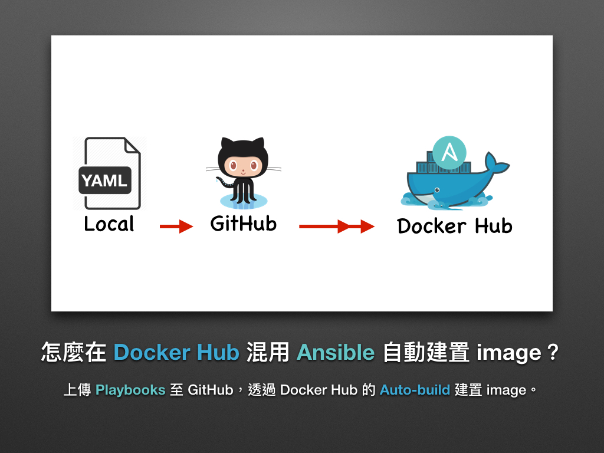

### Docker Hub 是什麼？

[Docker Hub][docker_hub] 是官方維護的 image 市集 (marketplace)。我們可以在網站上取得 Ubuntu, Nginx, MySQL 等官方和社群成員所維護的 image。 

[docker_hub]: https://hub.docker.com/explore/

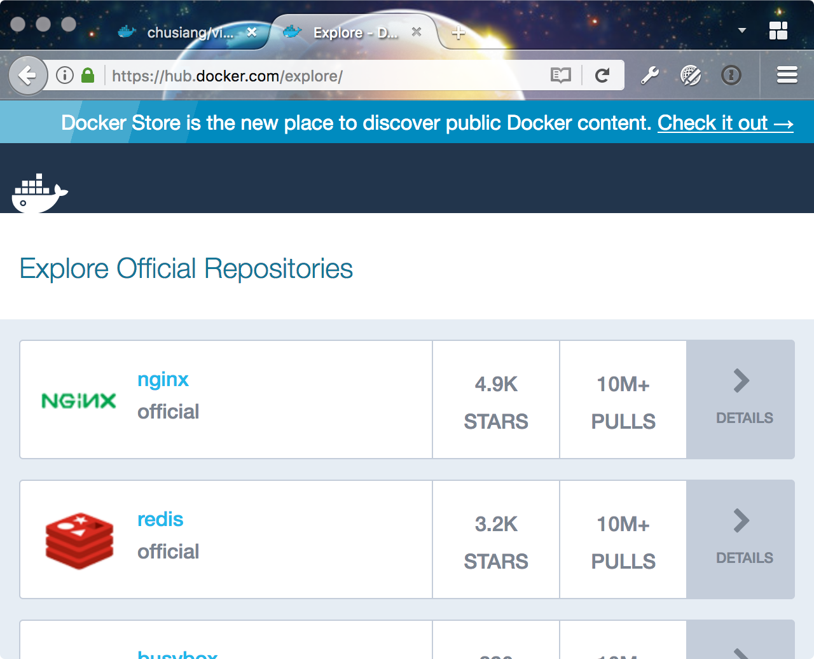

### chusiang/vim-and-vi-mode 是什麼？

`chusiang/vim-and-vi-mode` 是藉由 Dockerfile 和 `chusiang.vim-and-vi-mode` role 建置的 Docker image，上章已提過該 Role，在此就不多加詳述。

- Docker Hub: https://hub.docker.com/r/chusiang/vim-and-vi-mode/
- Galaxy: https://galaxy.ansible.com/chusiang/vim-and-vi-mode/
- GitHub: https://github.com/chusiang/vim-and-vi-mode.ansible.role/

目前支援的 Linux 發行版本有：

- ubuntu14.04, lastest
- ubuntu16.04
- debian7
- debian8
- centos6
- centos7

### 怎麼在 Docker Hub 自動建置 Docker image？

**建立 Dockerfile** 的前置作業凍仁已在上章介紹過，這裡就不多提了。

1. 登入 Docker Hub。
1. 點擊右上角的 **Create (建立)**，並點擊 **Create Automated Build (自動建置)**。
  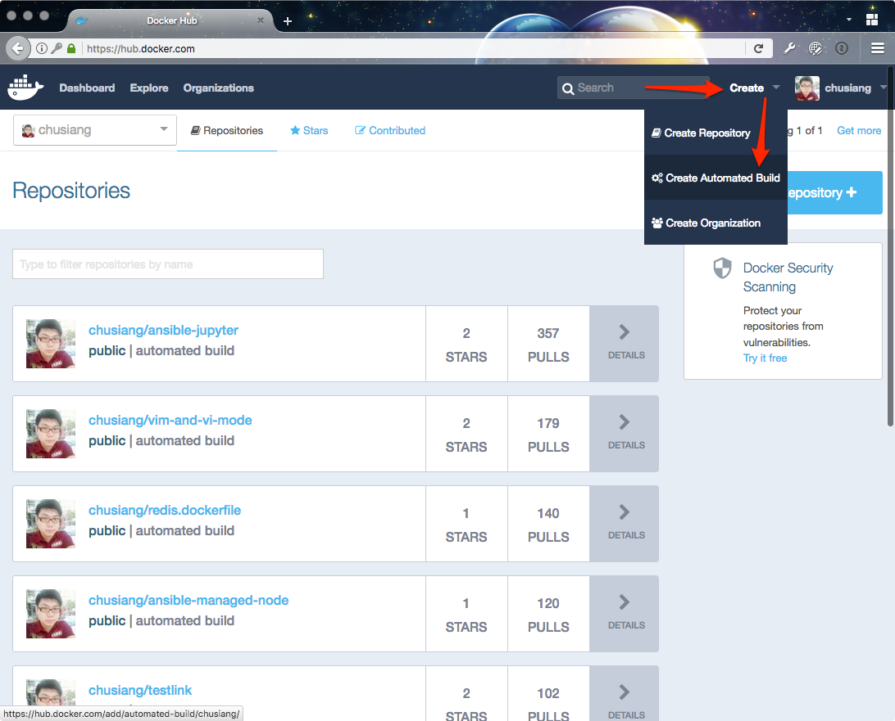

1. 選擇 GitHub。
  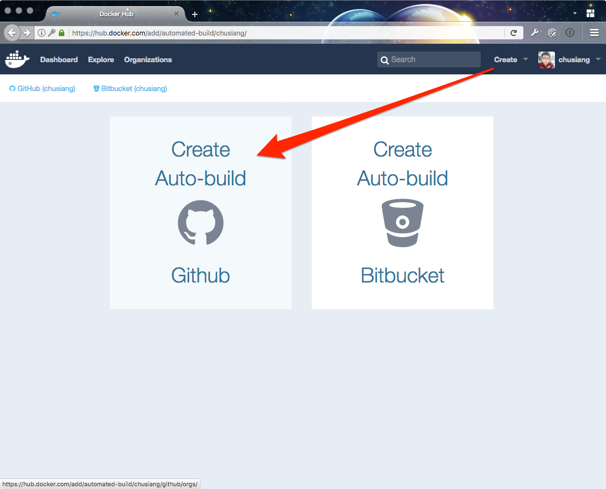

1. 找到要 Auto-build 的 GitHub repository。 
  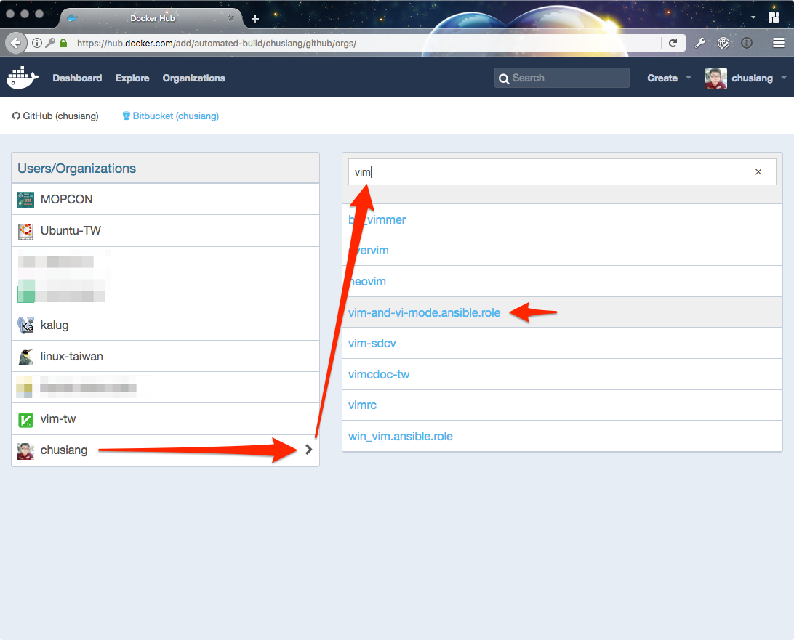

1. 選擇好 repository 後，可以在 **Name** 一欄設定名稱。
  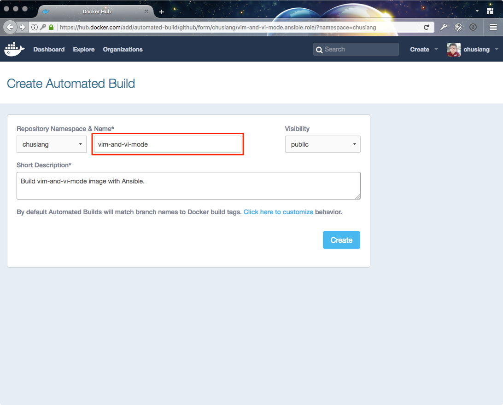
  > 注意！按下送出後就不能變更名稱了！

1. 進入 **Build Settings** 頁面設置 build image 相關設定。
  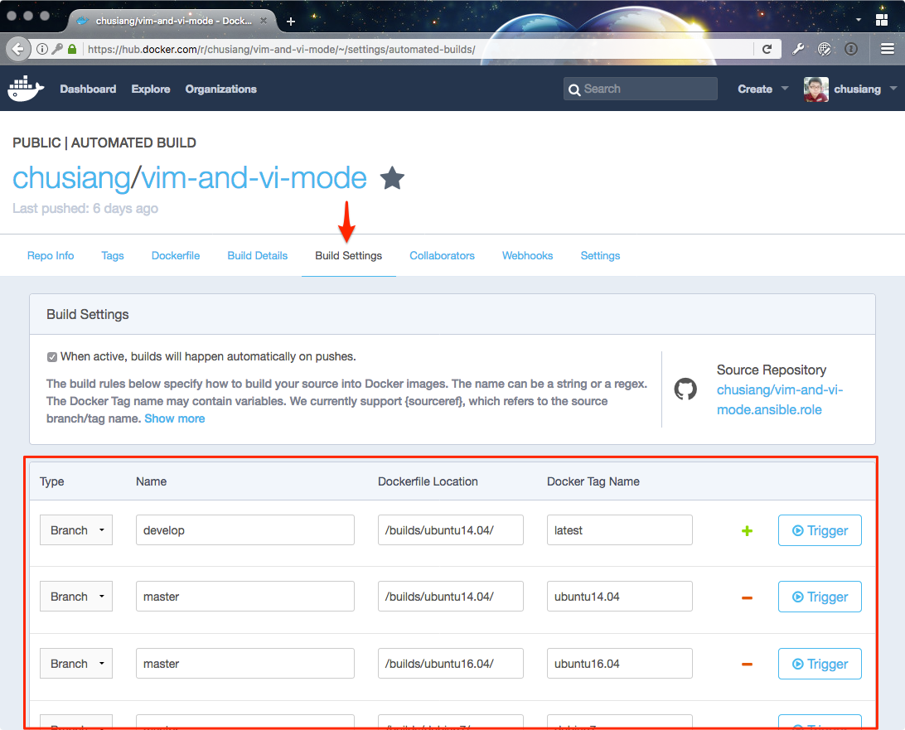

  1. Type：依 branch 或 tag 進行建置。
  1. Name：設置 branch 和 tag 的名稱。
  1. Dockerfile Location：Dockerfile 的存放路徑。
  1. Docker Tag Name：設置 Docker tag 名稱。

1. 在還末推送提交 (push commit) 之前，可先藉由右方的 Trigger 進行手動 build image。
1. 在 **Build Details** 頁面裡可以觀看建置狀態。
  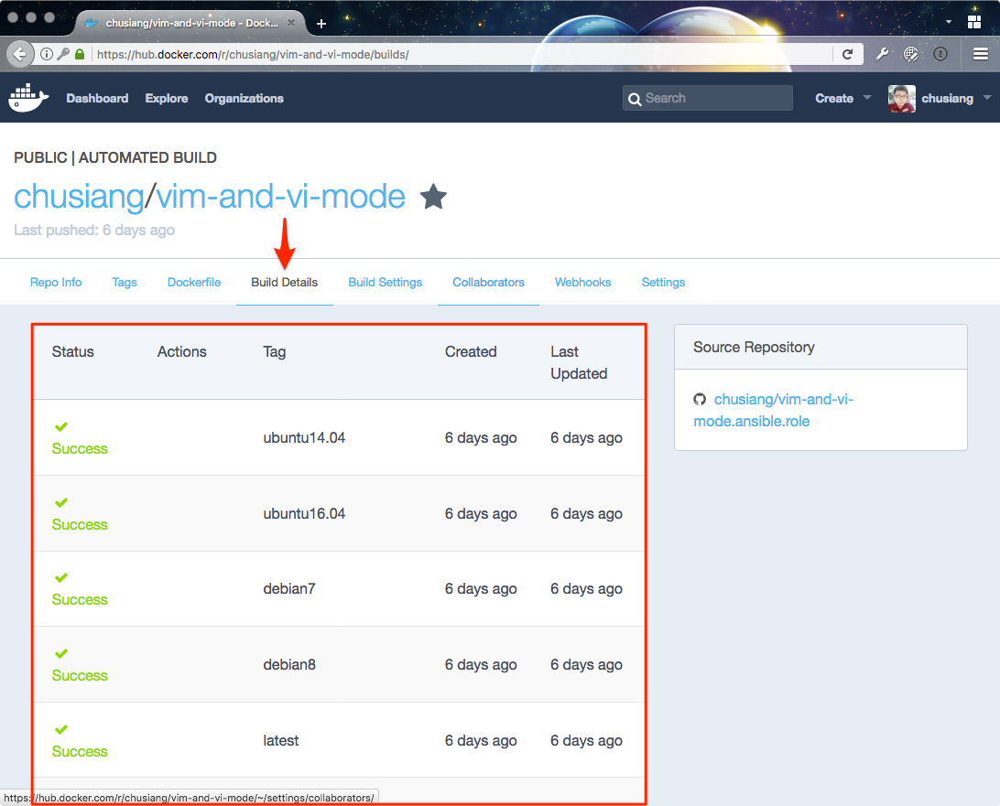

1. 在 **Tags** 頁面可以看到這個 image 有哪些 tag 可以用。
  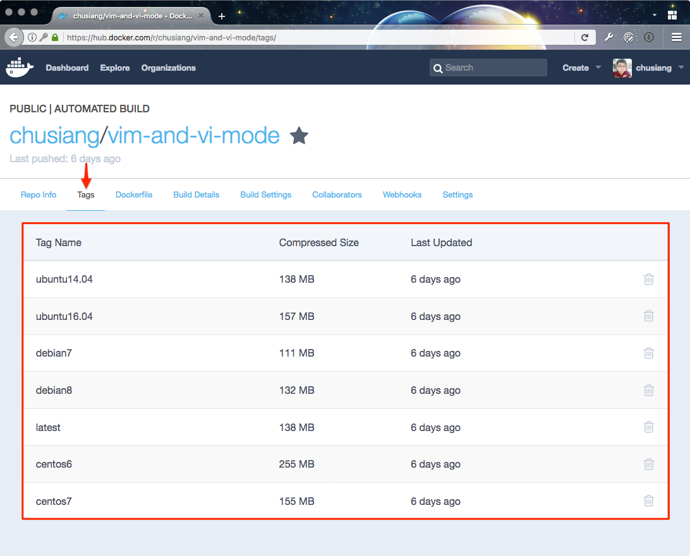

1. 在 **Dockerfile** 頁面可以看到內容與上章介紹的雷同。
  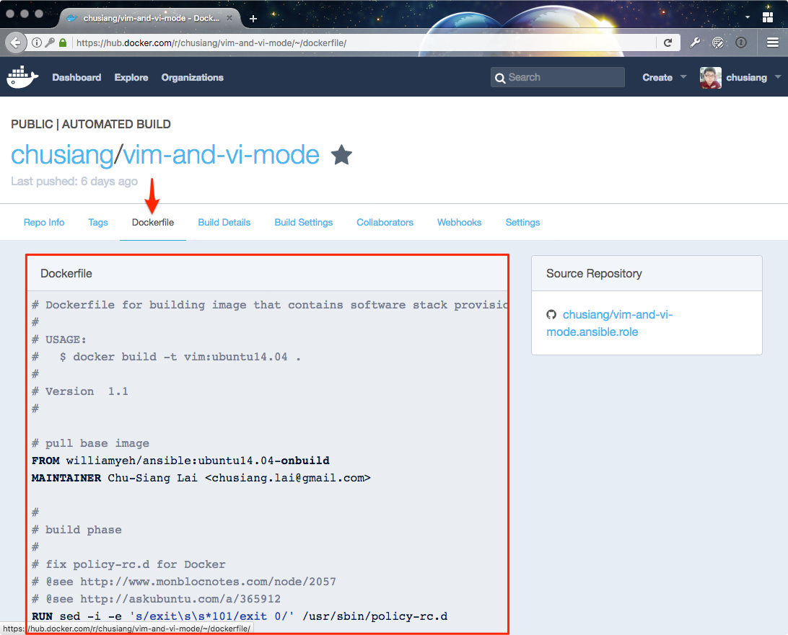

1. 現在，我們可以從 **Docker Pull Command** 取得下載 image 的指令，並可從 **Source Repository** 取得原始碼。
  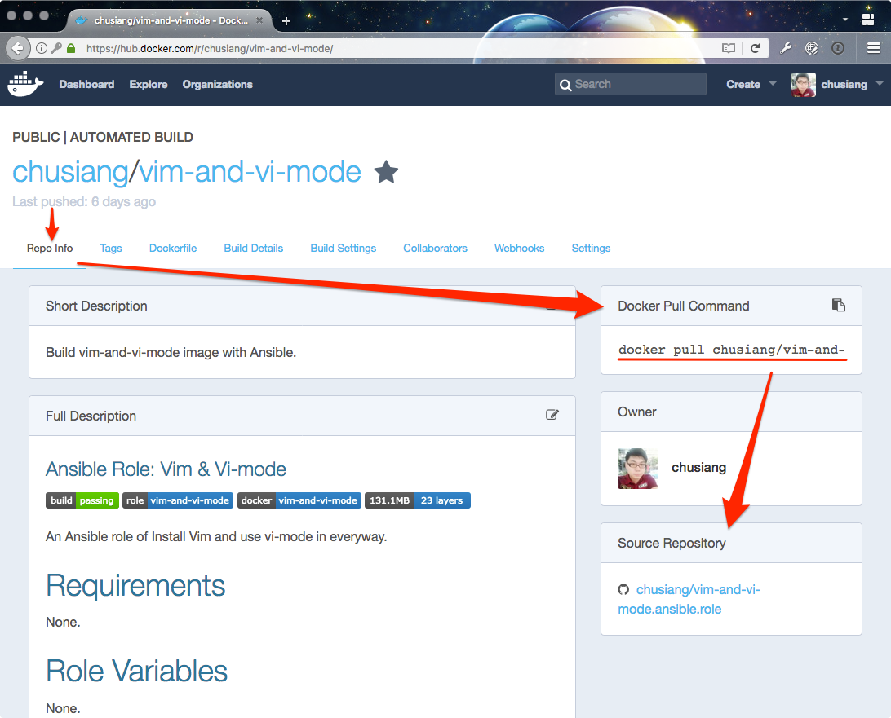

以上就是 Docker Hub 的 Auto-build 設置。現在我們除了可以用一份 Ansible Roles 進行組態設定，還可以從 Docker Hub 取得 build 好的 Docker image，真是一舉兩得啊！

### 後語

自從有了這些 Docker images，不管是自己要跨 Linux 平台測環境，還是幫 [Vim Taiwan User Group][vim_tw] 社群成員的 vimrc 除錯都有很大的幫助呢！

[vim_tw]: http://www.vim.tw

### 相關連結

- [Docker Hub | Docker](https://www.docker.com/products/docker-hub)
- [Docker Hub · 《Docker —— 從入門到實踐­》正體中文版](https://philipzheng.gitbooks.io/docker_practice/content/repository/dockerhub.html)

