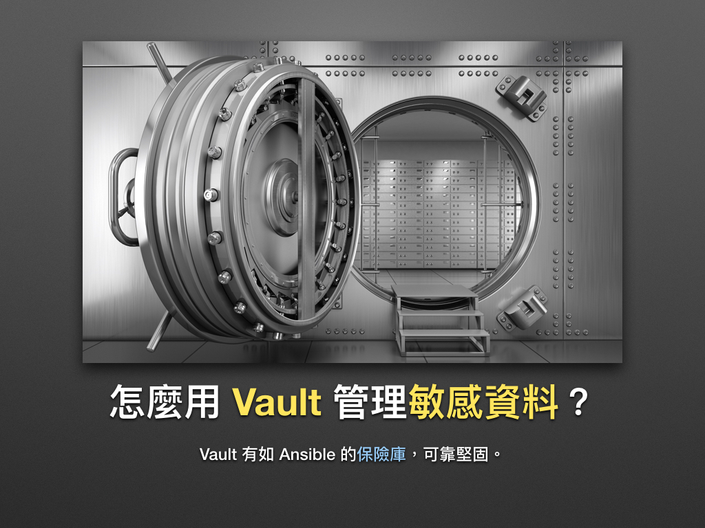
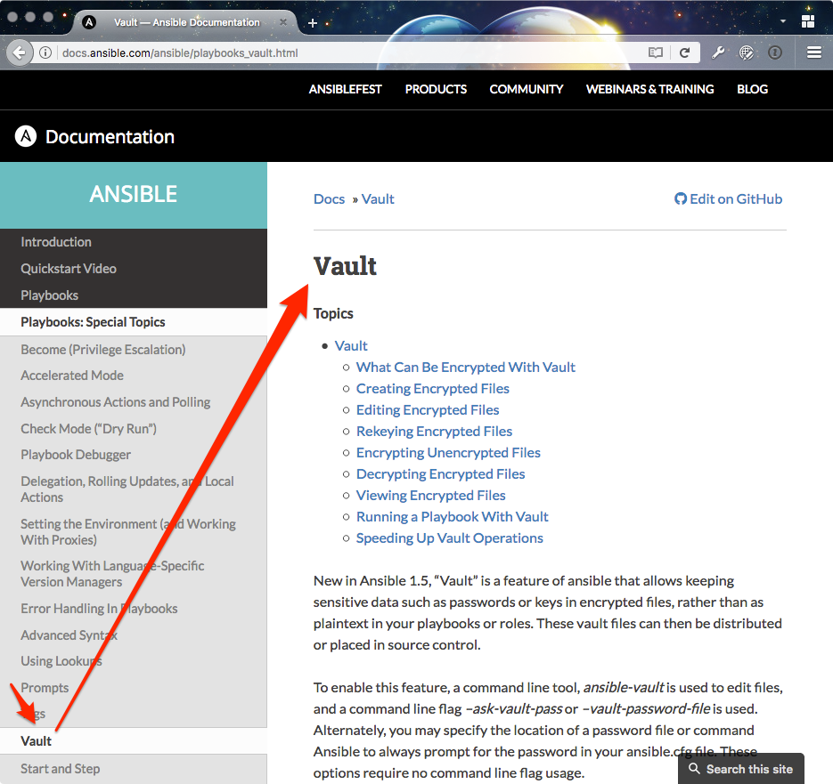
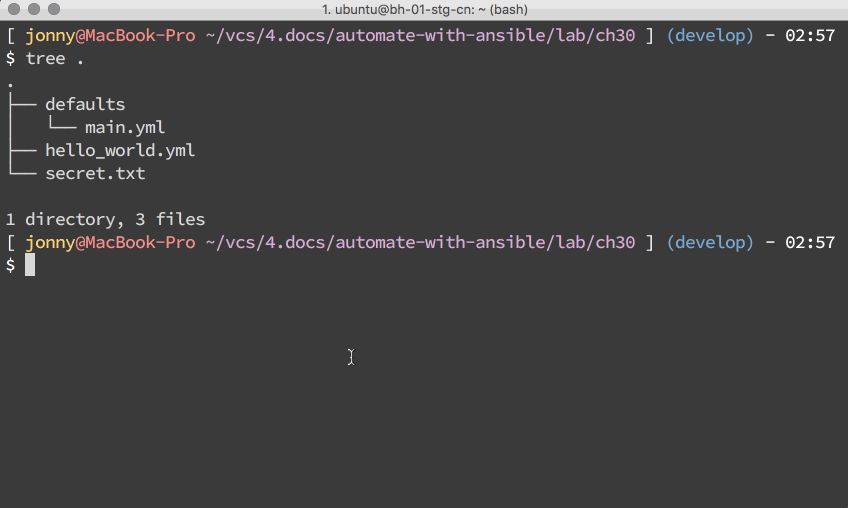

# 現代 IT 人一定要知道的 Ansible 自動化組態技巧

## 30. 怎麼用 Vault 管理敏感資料？

導入 Ansible 組態工具，多少會使用**明文 (Plain text)** 在 Playbooks 裡存放敏感資料 (sensitive data) [^1]，更別說我們還會搭配 Git 版本系統使用，這很可能會造成潛在的資安風險！接下來凍仁將透過 Vault 這個保險庫系統強化**資料安全**。


▲ 圖片來源：http://kingofwallpapers.com/vault.html 。


### Vault 是什麼？

Vault 就字面上的意義有地窖、**保險庫**的意思。在 Ansible 裡是指加密、解密檔案的技術。

Ansible 從 v1.5 開始支援此功能，預設使用 [AES 加密技術][wikipedia_aes]，其詳細說明可參考 [Vault | Ansible Documentation][ansible_docs_vault] 官方文件。



[wikipedia_aes]: https://zh.wikipedia.org/zh-tw/高级加密标准
[ansible_docs_vault]: http://docs.ansible.com/ansible/playbooks_vault.html

### 怎麼使用 Vault？

在進入實作之前，先來看看 Vault 的使用方法。

1. 建立加密 (Encrypted) 檔案。

   ```
   $ ansible-vault create foo.yml
   ```

1. 編輯加密檔案內容。

   ```
   $ ansible-vault edit foo.yml
   ```

1. 更換加密金鑰 (密碼)。

   ```
   $ ansible-vault rekey foo.yml
   ```

1. 對已存在的明文檔案進行加密

   ```
   $ ansible-vault encrypt foo.yml
   ```

1. 解開 (Decrypt) 已加密檔案。

   ```
   $ ansible-vault decrypt foo.yml
   ```

1. 檢視已加密的檔案內容。

   ```
   $ ansible-vault view foo.yml
   ```

### 怎麼在 Playbooks 裡使用 Vault？

以下將藉由簡單的實作來展示 Playbook 搭配 Vault 的使用方法。

1. 建立 Playbook。

   ``` 
   $ vi hello_world.yml
   ---
   - name: say 'hello world'
     hosts: all
     vars_files:
       - defaults/main.yml
     tasks:
       - name: echo 'hello world'
         command: echo 'hello {{ world }}'
         register: result
       - name: print stdout
         debug:
           msg: "{{ result.stdout }}"

   # vim: ft=ansible :
   
   ```

   > 註：`raw` 和 `endraw` 是為了相容 GitBook 所增加的語法，您可能會在某平台上看到它，請忽略之。

1. 建立變數檔案。

   ```
   $ vi defaults/main.yml
   world: 'ironman'
   ```

1. 將變數檔案進行加密：過程中需輸入兩次密碼。

   ```
   $ ansible-vault encrypt defaults/main.yml
   New Vault password:
   Confirm New Vault password:
   Encryption successful
   ```

1. 檢視已加密的檔案內容：使用剛剛輸入的密碼進行檢視。

   ```
   $ ansible-vault view defaults/main.yml
   Vault password:
   world: 'ironman'
   ```

#### 手動輸入金鑰 (密碼) 解密

1. 執行 Playbook 並搭配 `--ask-vault-pass` 參數手動輸入密碼。

   ```
   $ ansible-playbook hello_world.yml --ask-vault-pass
   ```

1. 或透過 `ansible.cfg` 啟用 `ask_vault_pass`，其預設值為 false。

  1. 設定 `ansible.cfg`。

     ```
     $ vi ansible.cfg
     [defaults]
     ask_vault_pass = true
     ```

  1. 執行 Playbook。

     ```
     $ ansible-playbook hello_world.yml
     ```

#### 透過金鑰 (密碼) 檔解密

1. 建立密碼檔：此例用的密碼為 `bGpvxx`。

   ```
   $ echo 'bGpvxx' > secret.txt
   ```

1. 執行 Playbook 並搭配 `--vault-password-file` 參數指定金鑰路徑。

   ```
   $ ansible-playbook hello_world.yml --vault-password-file secret.txt
   ```

1. 或於 `ansible.cfg` 裡新增 `vault_password_file` 參數，並指定金鑰路徑。

   ```
   $ vi ansible.cfg
   [defaults]
   vault_password_file = secret.txt
   ```

最後附上凍仁的實作畫面。



- 當 include 到 `defaults/main.yml` 密文 (Cipher text) 檔後，需先用 Vault 解開才可繼續執行。


### 後語

或許大家覺得在本機儲存敏感資料很安全，誰又能保證傳輸過程中能不被竊取呢？越方便的工具往往伴隨著越大的資安風險，但至少，我們可以先從檔案加密著手。


### 相關連結

- [Vault | Ansible Documentation][ansible_docs_vault]
- [《雲端資安與隱私｜企業風險應對之道》][cloud_security_and_privacy]
- [Windows 7 BitLocker 磁碟機加密設計指南 | Microsoft][win7_bitlocker]

[ansible_docs_vault]: http://docs.ansible.com/ansible/playbooks_vault.html
[cloud_security_and_privacy]: http://books.gotop.com.tw/o_A270
[win7_bitlocker]: https://technet.microsoft.com/zh-tw/library/ee706536(v=ws.10).aspx


[^1]: 資料庫伺服器 (database server) 的連線資訊、第三方服務的 Access Key 和 Secret 等都算是敏感資料的一種。

